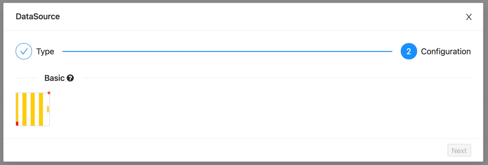

数据源主要用于管理 Clickhouse 服务数据源，用于后期查询监控。

### 创建数据源

---

鼠标移向顶部菜单 `Management` 等待下拉选择项出来后, 点击 `DataSource` 即可进入数据源管理界面, 它类似于以下页面

!!! note

    初次打开入软件时,在页面中间会展示一个 `Add` 蓝色按钮!

单击 `Add` 按钮（蓝色）添加数据源。出现以下弹出框：

##### 数据源类型

---

第一步我们需要选择数据源的类型, 我们点击 `ClickHouse` 图标选择该数据源,点击 `Next` 下一步进行参数配置

##### 数据源配置

---

有两种类型的数据源参数：

###### 基本设置

- `Alias`: 该字段仅用于标记当前属性的别名，默认 `localhost` 好记，无特殊含义
- `Protocol`: 连接服务协议，默认 `http`
- `Host`: 这里输入远程服务器的主机名或IP地址，默认 `localhost`
- `Port`: 这里输入远程服务器的主机地址，对应开放的端口，默认 `8123`
- `User Name`: 连接服务用户名，设置时输入，默认 `default`
- `Password`: 连接服务用户密码，如果设置请输入

###### 实验性设置

!!! note "注意"

    该配置可能不稳定,但是它不会导致软件错误,只会出现部分功能不生效,后续会持续转换为正式功能

- `MaxTotal`: 最大的数据查询行数

---

当我们填写基本配置完成后点击底部 `Test` 按钮, 测试通过后 `OK` 按钮即可点击.

点击 `OK` 按钮后, 我们将保存您编写的配置信息，以备下次使用

配置信息可以两种状态保存

- `Stop`: 停止状态，表示服务当前不可用，标有停止图标
- `Start`: 可用状态, 表示该服务当前可用于查询等操作，并标有播放图标

!!! note

    未测试通过的服务我们不允许保存,请确保它可用再次进行保存操作.

配置保存成功后会关闭弹出框并展示刚刚保存的数据列表在页面中

#### 数据源操作

---

在列表的顶部拥有两个按钮

:material-plus-circle:{.blue} 按钮用于添加新数据源

:material-refresh: 按钮用于刷新所有数据源

!!! warning

    该操作将会遍历所有的数据源进行请求验证数据源的可用性

##### 数据源列表

|字段| 描述       |
|---|----------|
|Alias| 该数据源别名   |
|Name| 数据源构建的名称 |
| Host | 数据源配置的主机名 |
|Protocol| 使用的访问协议  |
|User Name| 访问服务的用户名 |
|Version|当前服务器的版本|
|Action|数据源的额外操作|

如果测试有失败的会展示如下列表

##### 删除数据源

在数据源的列表数据的 `Action` 列下拥有一个 :material-delete-circle:{.red} 图标, 当我们点击它后会出现如下内容

点击 `OK` 按钮后数据源将被删除

点击 `Cancel` 关闭提示框不做任何处理

##### 修改数据源

修改和添加操作基本一致,不同的是修改在调起弹出框时会将数据填充到相应的输入框内.
