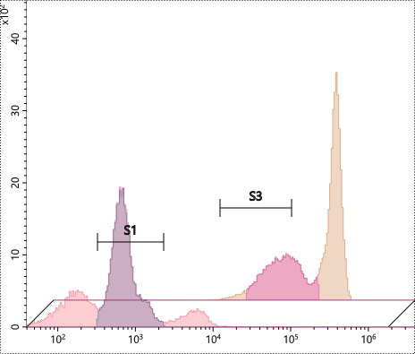

# 开源不易，感谢支持
  

# 如需定制，请联系：Lvwl@outlook.com

# FCSVisualChart 流式细胞术图表控件 [Gitee](https://gitee.com/Lvwl-CN/FCSVisualChart) 
 支持Line、Log数据轴  
 支持散点图、直方图、密度图、伪彩图、等高线图  
 支持段选门、椭圆门、多边形门、四边形门、横线门、竖线门、四象限门  
 支持多数据源  
 支持鼠标滚轮放大缩小，鼠标左键平移操作  
 支持直方图多数据源错位显示  
 支持门内数据突出显示  


  
  
  
  
 
## Chart
 | 属性 | 含义 | 类型 | 说明 |
 | --- | --- | --- | --- |
 | MoveType | 移动方式 | ChangeType | 鼠标左键控制图表移动方式 |
 | ZoomType | 缩放方式 | ChangeType | 鼠标滚轮控制图表缩放方式 |
 | DataSource | 数据源 | ObservableCollection< ChartDataSource > |  |
 | XAxis | x轴 | IAxis |  |
 | YAxis | y轴 | IAxis |  |
 | Series | 显示的图 | ISeries |  |
 | Gates | 门的集合 | ObservableCollection< BaseGate > |  |
 | CanChangeGate | 是否可以更改门 | bool |  |
 | GateChangedCommand | 门发生变化触发命令 | ICommand | 只写，CommandParameter是门对象 |
 | GateGotFocusCommand | 门得到焦点触发命令 | ICommand | 只写，CommandParameter是门对象 |
 | GateLostFocusCommand | 门失去焦点触发命令 | ICommand | 只写，CommandParameter是门对象 |
 | CreateNewAreaNameFunction | 门划分的区域的命名方式 | Func< BaseGate, string > |  |
 | ExistedGateAreaNames | 已存在的门划分的区域的名称集合 | Dictionary< string, int > | 默认门划分区域命名方式使用 |
 | GainMinValue | 增益最小值 | double |  |
 | GainMaxValue | 增益最大值 | double |  |
 | GainXValue | x轴增益值 | double |  |
 | GainYValue | y轴增益值 | double |  |
 | GainXCanChange | x轴的增益是否可编辑 | bool |  |
 | GainYCanChange | y轴的增益是否可编辑 | bool |  |
 | GainXValueChangedCommand | x轴增益更改完成命令 | ICommand | 只写 |
 | GainYValueChangedCommand | y轴增益更改完成命令 | ICommand | 只写 |
 | GainStrokeThickness | 增益图标边框粗细 | double |  |
 | GainStroke | 增益图标边框色 | Brush |  |
 | GainFill | 增益图标填充色 | Brush |  |
 | ThresholdVisibility | 是否显示阈值控制线 | Visibility |  |
 | ThresholdMinValue | 阈值最小值 | double |  |
 | ThresholdMaxValue | 阈值最大值 | double |  |
 | ThresholdValue | 阈值 | double |  |
 | ThresholdValueChangedCommand | 阈值变化命令 | ICommand | 只写 |
 | ThresholdStrokeThickness | 阈值控制线条宽度 | Thickness |  |
 | ThresholdFill | 阈值控制线填充色 | Brush |  |
 | ThresholdStroke | 阈值控制线边框色 | Brush |  |
 | ThresholdGeometry | 阈值控制线条矢量数据 | Geometry | 只读 |
 | ThresholdCenterPointSize | 阈值控制线中心点的大小 | byte |  |
 | ShowGateAreaGeometry | 是否以不同颜色显示门划分的区域 | bool | 尽量不要启用该功能，尤其是采集过程中，严重影响速度 |

 ### ChangeType 枚举
 | 属性 | 含义 | 说明 |
 | --- | --- | --- |
 | None | 不变更 |  |
 | X | 沿X轴变更 |  |
 | Y | 沿Y轴变更 |  |
 | XY | 沿XY轴变更 |  |

 ### ChartDataSource
 | 属性 | 含义 | 类型 | 说明 |
 | --- | --- | --- | --- |
 | XSource | x轴数据源 | IList |  |
 | YSource | y轴数据源 | IList |  |
 | Indexs | 有效数据索引 | IList< int > | 门划分的区域会形成新的数据源 |
 | DisplayIndexs | 显示数据索引 | IList< int > | 数据不一定全部需要显示，在采集过程中只需要显示刚采集到的数据 |
 | AreaIndexs | 门划分的区域集合 | ObservableDictionary< GateArea, IList< int > > | 区域对应的索引集合，ObservableDictionary实现了INotifyCollectionChanged、INotifyPropertyChanged接口 |
 | XSourceConverter | x值转换方法 | Func< object, double > | 数据源中的值转换成double值方法 |
 | YSourceConverter | y值转换方法 | Func< object, double > | 数据源中的值转换成double值方法 |
 | DisplayColor | 显示的颜色 | Color | 直方图、散点图、密度图以此颜色显示 |
 | IsDrawing | 是否正在绘制图形 | bool | 只读 |

## Axis
 ### IAxis 轴基类
 | 属性 | 含义 | 类型 | 说明 |
 | --- | --- | --- | --- |
 | OwnerChart | 所属的Chart控件 | Chart | 只读 |
 | AxisType | 轴类型 | AxisType | 只读，轴控件赋值给Chart控件后，Chart控件为其赋值 |
 | Foreground | 显示的前景色 | Brush |  |
 | FontSize | 显示的数字大小 | double |  |
 | PowerFontSize | 显示的指数数字大小 | double |  |
 | Max | 坐标最大值 | double |  |
 | Min | 坐标最小值 | double |  |
 | SetMaxMin（double，double） | 重置最大最小值 | void | Max和Min是只读，只能通过此方法修改 |
 | GetValueAxisConvertParam（） | 实际值和坐标值转换时使用的参数 | ValueAxisConvertParamBase |  |
 | ValueToAxisValue（double）、ValueToAxisValue（double，ValueAxisConvertParamBase） | 实际值转坐标值方法 | double |  |
 | AxisValueToValue（double）、AxisValueToValue（double，ValueAxisConvertParamBase） | 坐标值转实际值方法 | double |  |
 | GetConvertParam（） | 获取实际值、坐标值、位置值转换参数 | ValueLocationConvertParam |  |
 | GetValueLocation（double）、GetValueLocation（double，ValueLocationConvertParam） | 实际值转位置值 | double |  |
 | GetAxisValueLocation（double）、GetAxisValueLocation（double，ValueLocationConvertParam） | 坐标值转位置值 | double |  |
 | GetLocationAxisValue（double）、GetLocationAxisValue（double，ValueLocationConvertParam） | 位置值转坐标值 | double |  |
 | GetLocationValue（double）、GetLocationValue（double，ValueLocationConvertParam） | 位置值转实际值 | double |  |

 ### AxisType 枚举,轴类型
 | 属性 | 含义 | 说明 |
 | --- | --- | --- |
 | X | X轴 |  |
 | Y | Y轴 |  |

 ### ValueLocationConvertParam 轴转换参数，实际值、坐标值、位置值相互转换时使用
 | 属性 | 含义 | 类型 | 说明 |
 | --- | --- | --- | --- |
 | MaxAxisValue | 最大坐标值 | double |  |
 | MinAxisValue | 最小坐标值 | double |  |
 | Length | 图长度 | double | X轴取控件的宽度，Y轴取控件的长度 |
 | AxisType | 轴类型 | AxisType |  |
 | ValueAxisParam | 实际值和坐标值转换参数 | ValueAxisConvertParamBase |  |

 ### LinearAxis 线性轴，继承自IAxis
 | 属性 | 含义 | 类型 | 说明 |
 | --- | --- | --- | --- |
 | Power | 10的次方数 | int |  |

 ### NegativeLogAxis 可负数指数轴，继承自IAxis
 | 属性 | 含义 | 类型 | 说明 |
 | --- | --- | --- | --- |
 | LogBase | log的底 | double | 正整数或常数e、π |
 | LinePowerCount | 线性显示的次方数，0附近 | uint | -Math.Pow(LogBase,LinePowerCount)~Math.Pow(LogBase,LinePowerCount)之间用线性显示 |

 ### NegativeLogValueAxisConvertParam 实际值和坐标值转换参数
 | 属性 | 含义 | 类型 | 说明 |
 | --- | --- | --- | --- |
 | LogBase | log的底 | double |  |
 | LinePowerCount | 线性显示的次方数，0附近 | uint |  |

## Series 显示的图
 ### ISeries 图的基类
 | 属性 | 含义 | 类型 | 说明 |
 | --- | --- | --- | --- |
 | OwnerChart | 所属chart控件 | Chart | 只读 |
 | ShowFill | 是否显示填充 | bool | 默认true |
 | ShowStroke | 是否显示边框 | bool | 默认true |
 | StrokeThickness | 边框粗细 | int | 默认1 |
 | FillColorA | 填充色不透明度 | byte | 默认0xff |
 | StrokeColorA | 边框不透明度 | byte | 默认0xff |
 | ExcessDisplayAtEdge | 超出边界是否压边显示 | bool | 默认true |
 | MaxDegreeOfParallelism | 计算图形时使用的线程数 | int | 默认4 |
 | GetModel（） | 获取图的模型 | BaseSeriesModel | 可用于序列化反序列化存储的数据模型 |
 | CreateByModel（BaseSeriesModel） | 从模型创建一个新的图 | ISeries |  |

 ### ContourSeries 等高线图，继承自ISeries
 | 属性 | 含义 | 类型 | 说明 |
 | --- | --- | --- | --- |
 | PointLength | 点宽度 | int | 默认4 |
 | GradeBase | 等高线分级基数 | int | 默认3 |
 | GradeType | 分级方式 | GradeType | 默认GradeType.Log |
 
 ### GradeType 枚举,分级方式
 | 属性 | 含义 | 说明 |
 | --- | --- | --- |
 | Line | 线性分级 |  |
 | Log | 对数分级 |  |
 
 ### DensitySeries 密度图，继承自ISeries
 | 属性 | 含义 | 类型 | 说明 |
 | --- | --- | --- | --- |
 | PointLength | 点宽度 | int | 默认2 |
 | MinOpacity | 最小不透明度 | byte | 默认0x10 |
 
 ### HistogramXStatisticsSeries X轴统计直方图，继承自ISeries
 | 属性 | 含义 | 类型 | 说明 |
 | --- | --- | --- | --- |
 | Count | 直方图等份数 | int | 默认256 |
 | Smooth | 是否平滑 | bool | 默认false |
 | SmoothPointCount | 简单平滑算法点数 | int | 默认2 |
 | OffsetX | x轴方向偏移量 | ushort | 多数据源显示时，对每个数据源显示的图形进行偏移 |
 | OffsetY | y轴方向偏移量 | ushort | 门的绘制只在最前方的数据源坐标系上绘制 |
 
 ### PseudoColorSeries 伪彩图，继承自ISeries
 | 属性 | 含义 | 类型 | 说明 |
 | --- | --- | --- | --- |
 | PointLength | 点宽度 | int | 默认2 |
 
 ### ScatterSeries 散点图，继承自ISeries
 | 属性 | 含义 | 类型 | 说明 |
 | --- | --- | --- | --- |
 | PointLength | 点的宽度 | int | 默认2 |

## Gate 门
 ### GateArea 门划分的区域
 | 属性 | 含义 | 类型 | 说明 |
 | --- | --- | --- | --- |
 | Name | 区域名称 | string |  |
 | DisplayColor | 显示的颜色 | Color |  |
 | OwnerGate | 所属的门 | BaseGate | 只读 |

 ### BaseGate 门的基类
 | 属性 | 含义 | 类型 | 说明 |
 | --- | --- | --- | --- |
 | Fill | 门的填充颜色 | Brush | 默认Brushes.Transparent |
 | Stroke | 门的线条颜色 | Brush | 默认Brushes.Black |
 | StrokeThickness | 门的线条粗细 | double | 默认1 |
 | AreaNameFontSize | 区域名称文字大小 | double | 默认14 |
 | AreaNameTypeface | 区域名称文字字体 | Typeface | 默认Segoe UI |
 | ShortName | 门划分区域名称前缀 | string | 只读 |
 | AreaCount | 门划分的区域数量 | int | 只读 |
 | OwnerChart | 所属Chart控件 | Chart | 只读 |
 | Areas | 门划分的区域集合 | GateArea[] | 只读 |
 | IsCreating | 是否创建中 | bool | 只读 |
 | Dispose() | 删除门 | void |  |
 | DataInArea（double，double，AreaIndexFuncParam) | 数据在门划分的哪个区域内 | GateArea | 返回null表示不在任何区域 |
 | GetAreaIndexsFuncParam（） | 获取判断点在门划分哪个区域的方法的参数 | AreaIndexsFuncParam |  |
 | GetModel（） | 获取门的模型 | BaseGateModel |  |

 ### BaseGateModel 门的数据模型基类
 | 属性 | 含义 | 类型 | 说明 |
 | --- | --- | --- | --- |
 | AreaNames | 区域名称集合 | string[] |  |
 | AreaColors | 区域显示颜色集合 | string[] | FFFFFFFF：ARGB格式 |

 ### EllipseGate 椭圆门，继承自BaseGate
 | 属性 | 含义 | 类型 | 说明 |
 | --- | --- | --- | --- |
 | Center | 椭圆的中心点 | Point | 实际值，只读 |
 | HalfWidth | 椭圆宽度 | double | 坐标值，只读 |
 | HalfHeight | 椭圆高度 | double | 坐标值，只读 |
 | Angle | 旋转角度 | double | 只读 |
 | Radian | 旋转弧度 | double | 只读 |

 ### EllipseGateModel 椭圆门模型，继承自BaseGateModel
 | 属性 | 含义 | 类型 | 说明 |
 | --- | --- | --- | --- |
 | Center | 椭圆中心点 | Point |  |
 | HalfWidth |  | double |  |
 | HalfHeight |  | double |  |
 | Angle |  | double |  |

 ### LineHorizontalGate 横线门，继承自BaseGate
 | 属性 | 含义 | 类型 | 说明 |
 | --- | --- | --- | --- |
 | Y | 横线Y实际值 | double | 只读 |

 ### LineHorizontalGateModel 横线门模型，继承自BaseGateModel
 | 属性 | 含义 | 类型 | 说明 |
 | --- | --- | --- | --- |
 | Y | 横线Y实际值 | double |  |

 ### LineVerticalGate 竖线门，继承自BaseGate
 | 属性 | 含义 | 类型 | 说明 |
 | --- | --- | --- | --- |
 | X | 竖线X实际值 | double | 只读 |

 ### LineVerticalGateModel 竖线门模型，继承自BaseGateModel
 | 属性 | 含义 | 类型 | 说明 |
 | --- | --- | --- | --- |
 | X | 竖线X实际值 | double |  |
 
 ### PolygonGate 多边形门，继承自BaseGate
 | 属性 | 含义 | 类型 | 说明 |
 | --- | --- | --- | --- |
 | Points | 多边形点位实际值 | List< Point > | 只读 |

 ### PolygonGateModel 多边形门模型，继承自BaseGateModel
 | 属性 | 含义 | 类型 | 说明 |
 | --- | --- | --- | --- |
 | Points | 多边形点位实际值 | List< Point > |  |

 ### RectangleGate 四边形门，继承自BaseGate
 | 属性 | 含义 | 类型 | 说明 |
 | --- | --- | --- | --- |
 | X1 | 四边形左上角X实际值 | double | 只读 |
 | X2 | 四边形右下角X实际值 | double | 只读 |
 | Y1 | 四边形左上角Y实际值 | double | 只读 |
 | Y2 | 四边形右下角Y实际值 | double | 只读 |

 ### RectangleGateModel 四边形门模型，继承自BaseGateModel
 | 属性 | 含义 | 类型 | 说明 |
 | --- | --- | --- | --- |
 | X1 | 四边形左上角X实际值 | double |  |
 | X2 | 四边形右下角X实际值 | double |  |
 | Y1 | 四边形左上角Y实际值 | double |  |
 | Y2 | 四边形右下角Y实际值 | double |  |

 ### QuadrantGate 四象限门，继承自BaseGate
 | 属性 | 含义 | 类型 | 说明 |
 | --- | --- | --- | --- |
 | Center | 四象限门中线点实际值 | Point | 只读 |
 | Angle1 | 左边线条顺时针旋转角度，-x方向角度为0 | double | 只读 |
 | Angle2 | 上边线条顺时针旋转角度，y方向角度为0 | double | 只读 |
 | Angle3 | 右边线条顺时针旋转角度，x方向角度为0 | double | 只读 |
 | Angle4 | 下边线条顺时针旋转角度，-y方向角度为0 | double | 只读 |

 ### QuadrantGateModel 四象限门模型，继承自BaseGateModel
 | 属性 | 含义 | 类型 | 说明 |
 | --- | --- | --- | --- |
 | Center | 四象限门中线点实际值 | Point |  |
 | Angle1 | 左边线条顺时针旋转角度，-x方向角度为0 | double |  |
 | Angle2 | 上边线条顺时针旋转角度，y方向角度为0 | double |  |
 | Angle3 | 右边线条顺时针旋转角度，x方向角度为0 | double |  |
 | Angle4 | 下边线条顺时针旋转角度，-y方向角度为0 | double |  |

 ### SegmentXGate X轴段选门，继承自BaseGate
 | 属性 | 含义 | 类型 | 说明 |
 | --- | --- | --- | --- |
 | X1 | 段选门x实际值1 | double | 只读 |
 | X2 | 段选门x实际值2 | double | 只读 |
 | Y | 段选门在图上Y轴显示的位置值 | double | 只读 |

 ### SegmentXGateModel X轴段选门模型，继承自BaseGateModel
 | 属性 | 含义 | 类型 | 说明 |
 | --- | --- | --- | --- |
 | X1 | 段选门x实际值1 | double |  |
 | X2 | 段选门x实际值2 | double |  |
 | Y | 段选门在图上Y轴显示的位置值 | double |  |

 ## 示例
 ### 前端
``` 
<chart:Chart x:Name="chart">
    <chart:Chart.Series>
        <chart:ScatterSeries/>
    </chart:Chart.Series>
    <chart:Chart.XAxis>
        <chart:NegativeLogAxis/>
    </chart:Chart.XAxis>
    <chart:Chart.YAxis>
        <chart:NegativeLogAxis/>
    </chart:Chart.YAxis>
</chart:Chart>
```
### 后端
使用到[FCS](https://gitee.com/Lvwl-CN/FCS)库
```
var fcs = FCS.Factory.ReadFileOneDataset(@"D:\Sample_003.fcs");
ChartDataSource data1 = new ChartDataSource() { XSource = fcs.Measurements[0].ChannelValues, YSource = fcs.Measurements[3].ChannelValues };
ChartDataSource data2 = new ChartDataSource() { XSource = fcs.Measurements[12].ChannelValues, YSource = fcs.Measurements[15].ChannelValues };
chart.DataSource = new System.Collections.ObjectModel.ObservableCollection<ChartDataSource>() { data1, data2 };
```

## 更新说明
### 1.2.1
1、添加门内数据以不同颜色显示功能，该功能尽量不启用，影响速度，尤其是采样过程中  
2、修复一些bug
### 1.1.5
1、修复一些bug
### 1.1.4
1、优化可负数指数轴，指数文字可阶段显示
### 1.1.3
1、修复Y轴增益无法调整bug
### 1.1.2
1、ChartDataSource类的DisplayColor属性的A值（不透明度）影响图的显示最大不透明度
### 1.1.1
1、添加门发生变化命令、门获取焦点命令和门失去焦点命令
### 1.1.0
1、添加阈值和增益控制，数据采集过程中可使用
