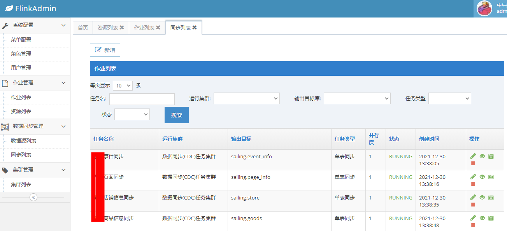

# flink-admin

#### 介绍
基于 flink rest api 的 flink web admin,  
支持任务持久化管理，JOB编辑、提交、启动、停止。  
支持多集群发布任务，任务根据场景选择不同的集群。  
支持一键Savepoint及指定Savepoint恢复任务。   
支持数据源管理，加密保存数据源配置信息。   
支持一键同步表结构。   
支持可视化配置单表，多表，全量及增量数据库同步任务（FlinkCDC实现）。  
支持 mysql to mysql,es.

#### 技术栈 
Springboot2.3.9 + FreeMarker+ flink1.13.3 + flinkCDC2.1.0

#### 架构图


#### 安装教程

##### 创建数据库
```
CREATE DATABASE IF NOT EXISTS flink-admin DEFAULT CHARSET utf8mb4;
SOURCE flink-admin.sql
```

##### 项目启动
```
git clone https://gitee.com/chongho/flink-admin.git
# mvn install
# java -jar flink-web-console.jar
```

#### 使用说明
http://localhost:8086/   
admin/123456  


#### 功能截图
上传资源包
    
作业列表 

新增作业 

数据同步作业 

新增数据同步作业


修改cdc初始化配置
1. 上传flink-cdc-job.jar 到flink集群.  
2. 修改对应的 jarId.   
 

#### TODO list
1. 支持在线 flink sql 任务

#### 参与贡献

1.  Fork 本仓库
2.  新建 Feat_xxx 分支
3.  提交代码
4.  新建 Pull Request

#### 特别说明
Copyright © 2022 中和农信
