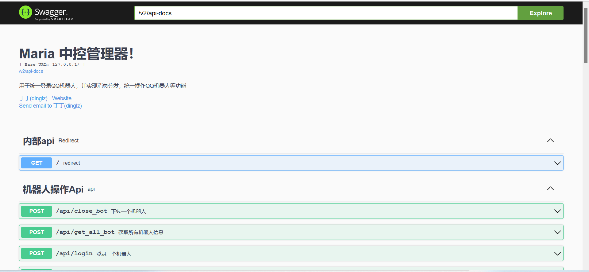
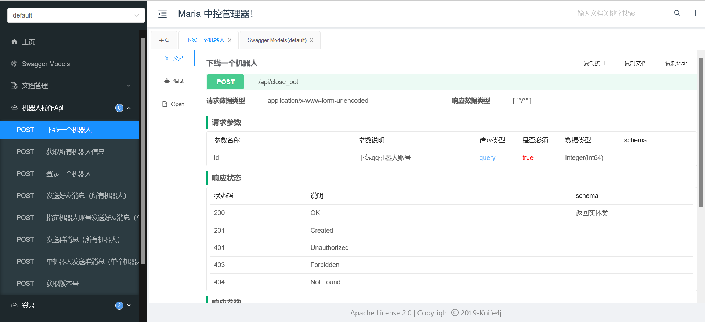

# MiraiManager

ps:可能类似于go-cqhttp，但是该程序支持多个机器人同时登录

## 太尬了，项目中单词拼错了的请自动忽略

该程序可以用于管理多个机器人，开发机器人功能的api

使用反向http，这样可以使其它语言实现qq机器人

已开放的api可以在部署地址/swagger/index.html观看

如图1（swagger-ui版本）

knife4j版本的api文档界面更加美观，人性化，可在部署地址/doc.html查看

如图2

内置文档通过swagger搭建





## 在线api文档：https://dinglz.gitee.io/miria-manager

## 反向http说明：https://dinglz.gitee.io/miria-manager/#59c6fad9-9d13-495b-b91f-c62299b6e6d4

## 一键启动版本(win64)

https://share.weiyun.com/pUlp3K5l

# 如何对接MiraiManager?

请查看项目下的sdks目录

已实现cpp sdk:https://gitee.com/dinglz/miria-manager/tree/master/sdks/cpp


# 编译方式

```sh
mvn clean build
```

# 运行方式

端口等信息在application.yml中修改

```sh
java -jar 发布的jar包
```

# 作者信息

丁丁（dinglz）

QQ：1149978856

邮箱：dlz1149978856

# connect

如果你想找个与开发者交流的地方，可以来这个群与我闲聊

[加群链接](https://jq.qq.com/?wv=1027&k=xVeaNh1X)

等该项目被我逐渐整活到完善，以及有一定量的用户，再考虑开用户群。现在该项目还处于不成熟阶段！