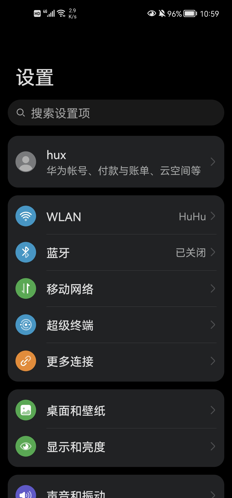
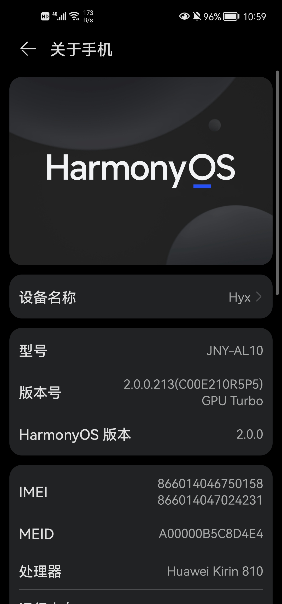
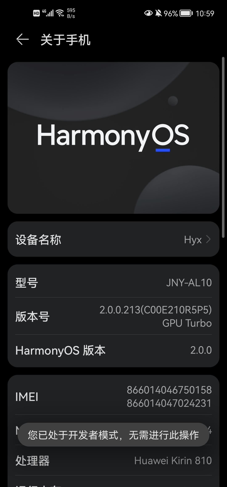
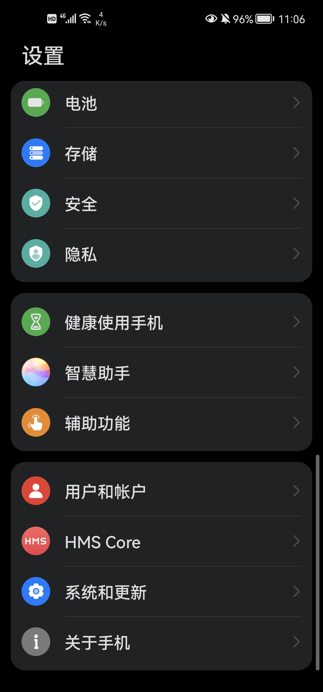
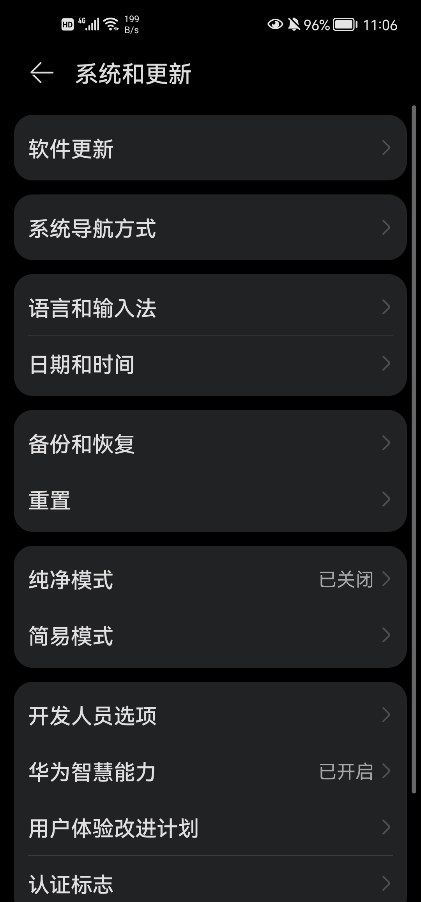
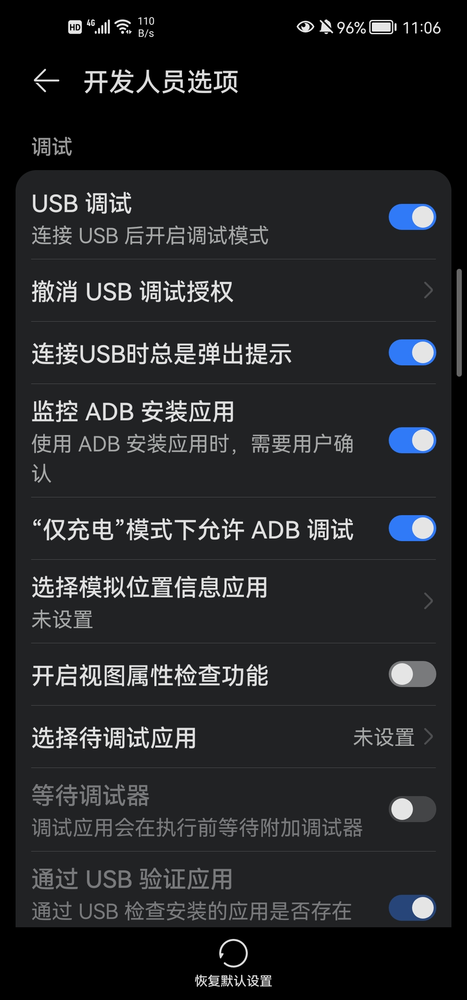
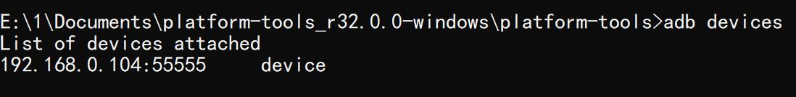
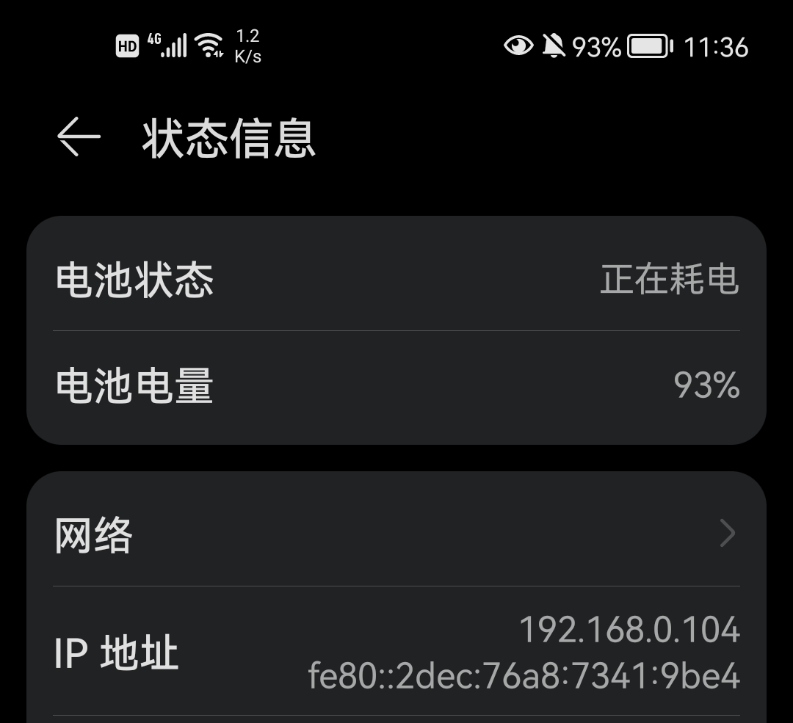

#  **智慧操控（WICA）** 


###   :sparkling_heart: 智慧操控：基于uiautomator2模块的电脑操控手机的功能的实现


###   :sparkling_heart: Windows Intelligently Controlling Android (WICA)


###  :memo: 项目介绍
该项目是基于uiautomator2这个Python模块的电脑操控手机的一个PC端的应用程序的设计，借助于这个项目，我们可以使用电脑（Windows系统）来控制我们的手机（Android系统），我们可以在电脑端操控手机中的任何软件，也可以实现任何的软件内部功能的使用，与我们正常的使用手机别无二致。在实现这样的功能时，需要借助于上述的模块，我们可以获取到手机的各种信息，同时也可以对手机发送命令，通过这种交互来实现电脑对手机的操控。

###   :satellite: 项目来源
我们在日常生活中常常需要在使用电脑的同时使用手机，比如：我们可能需要在手机上点击确认登录，我们可能需要使用手机来进行扫码，我们也可能需要使用手机来获取验证码，等等。如果我们不断地在电脑与手机之间进行切换，第一，比较麻烦，第二，效率也比较低下。因此，如果我们可以只是用一个设备就能够实现所有的功能的话，就会十分快捷方便。与此同时，我注意到现有的一些类似的软件有一些缺点，比如：有的软件只能够投屏而无法实现电脑操作手机的功能，有的软件只是适用于Mac电脑或者苹果手机，有的软件虽然可以实现电脑操控手机的功能，但是相对而言，时间的延迟是比较大的，有的软件功能比较完善但是安装与操作较为复杂，使用者可能要花很长时间才可以研究明白。基于以上几点，我决定自己制作一个电脑控制手机的软件，这就是该项目的来源。


###   :star: 项目亮点

该项目是基于Python模块uiautomator2的电脑操控手机的实现，在实现这个项目的过程中，使用了一些比较创新的思路和技术。首先，该项目通过Python语言来实现电脑以及手机之间的Android Debug Bridge（ADB）的连接，使得用户不需要输入任何指令就可以直接自动将电脑与手机连接起来了；其次，在使用uiautomator2模块的时候，不同于其他的程序通过Xpath的方法来获取所点击的位置，本项目没有采用Xpath或者text的方法来实现元素定位，而是通过像素点来进行定位，使得用户可以点击任何一个点然后传递给手机，手机也会点击相应的点，十分方便且快捷，同时不会出现任何错误；第三，该项目有许多的附加功能，比如：YOLO（You Look Only Once.）的使用是对Android手机的一个扩展，使得在安卓手机上面也可以实现YOLO了，文件传输可以方便用户将电脑的文件传输到手机中去，音乐播放器可以实现自定义播放的方式等等有很多的附加功能的；此外，使用opencv（cv2）实现了对手机屏幕的动态显示，便于用户进行操作；最后呢，一些快捷方式的设置可以使得用户可以仅仅使用一些按钮就可以完成复杂的操作，非常方便而且十分的实用。以上就是该项目的一些亮点。


###    :globe_with_meridians: 项目环境

为了保证整个项目可以正常的运行，需要有一些环境上面的要求，由于这里是适配于Windows与Android之间的电脑控制手机的，所以需要有以下所示的环境要求：


>电脑端：
>Windows 10 系统，adb调试软件可以正常运行，python3.8.10（其他版本也可以，只要高于python3.6就行），uiautomator2，opencv，weditor，wx等。（当然，如果准备直接运行exe文件的话，这里只有前两个条件是必须的，其他的条件就不需要了。）
>
>手机端：
>Android 系统（实际上是：HarmonyOS系统，但是不考虑各个设备使用华为的自带传输系统时，Android与HarmonyOS几乎没有区别，都是基于linux实现的），打开开发者模式。
>
>注意：
>如果系统不满足要求，可能会无法运行，但是也有可能可以正常运作，但是，还是建议符合上述的要求，这样就一定不会出现问题。
>


###   :thought_balloon: 项目整体构思

####   :one:  电脑与手机进行连接
为了实现电脑对手机的操控，我首先需要实现电脑与手机之间进行连接的操作，在查阅有关手机的调试以及与电脑之间的连接相关的内容之后，我选择了adb这个工具来实现电脑与手机之间的连接，adb全程为：Android Debug Bridge，意思是Android 调试桥。我的思路是使用这个adb工具，以此来实现电脑与手机之间的adb连接，这个工具使用十分简便，不需要安装就可以直接运行，所以非常适合我这个项目的使用。因此，我就使用adb来实现电脑与手机的连接。（与adb这个工具有关的一些介绍可以参考一下这篇文章，链接是：[https://developer.android.google.cn/studio/command-line/adb](https://developer.android.google.cn/studio/command-line/adb)）

####   :two: 初始化uiautomator2
在我们完成了第一步之后，需要配置python的环境以及初始化uiautomator2模块。我使用的python版本是3.8.10，原则上只要是高于3.6的版本就可以的，但也不建议使用最新的python版本，因为有可能会因为一些其他的模块没有更新从而导致安装的时候出现问题。
具体的还有一些别的注意点需要强调一下：
1、手机端需要安装ATX软件，这个在运行程序的时候软件会自动安装ATX的，但是还是需要用户在手机上确认安装；
2、为了使得电脑与手机之间的连接更加的稳定，建议在电脑与手机完成连接以后在手机端的ATX中开启悬浮窗，这样可以保证进程守护以及atx-agent的正常运行，此外，还可以帮助用户判断ATX是否处于工作的状态，一举多得；
3、在连接电脑与手机之后如果出现延时比较严重的问题，可能有两个原因，一是网络不稳定，而是ATX服务不稳定，这个时候可以选择检查ATX或者重启ATX来进行优化，但是网络问题需要自己解决了；
4、在安装ATX的时候可能会有一些其他的附加应用安装，请确认安装，这些应用没有任何病毒的，都是正常运行软件所必须的，如果没有安装，可能会导致运行失败或者无法控制的情况出现，请放心安装这些软件。


####   :three: 电脑获取手机相关信息
电脑在连接了手机以后，就可以直接获取得到手机的相关的信息了。比如：手机在局域网内部的IP地址、手机的型号等等。我们可以利用这些信息来方便在有线连接后续的无线连接的实现，同时，我们还可以获取一些诸如手机CPU、手机电池使用情况、手机的相关配置、手机正在运行的APP以及进程等等更加深入一些的信息，这些信息都可以使我们更加方便的对手机进行操控，同时也可以帮助用户在使用该软件的时候更加的简便了。


####   :four: 电脑向手机发送指令
在使用该软件的时候，需要使用电脑向手机发送指令，以此来实现电脑对手机的操控，手机在接收到了电脑发过来的指令以后，就会按照电脑的指令来进行相关的手机操作，并且在进行某些操作之后会给电脑返回指令的结果，以此来方便用户对指令执行情况的了解。在使用电脑对手机发送指令的时候使用了Python的uiautomator2这个模块来实现发送指令的功能的。

####   :five: 手机执行指令
在上述的电脑向手机发送指令以后，手机就会按照接收到的内容执行指令，在执行完成以后，手机会有一定的返回值，同样会利用uiautomator2这个模块将某些返回值发送给电脑，方便用户对手机执行指令的情况有一定的了解。然后，就会返回第三步，从而开始循环执行这些手机与电脑之间的交互以及执行的动作，以此来实现电脑对手机持续的精确的操控与控制。


####   :six: 图形化界面的设计
为了使得该项目比较美观而且易于使用，需要对该项目设计一个合适的图形化界面来方便操作，经过比较，最终有两个模块比较合适，一个是Qt模块，另一个是wx模块，在进行测试的时候，我发现wx模块使用起来更加的方便，而且界面设计也相对容易、快速一些，同时，二者的性能几乎相同，最终，我决定使用wx这个模块来进行图形化界面的设计以及实现。所以，后续的开发中将会使用wx模块来实现界面的设计。

###   :eyes: 项目具体实现方法

####   :one:  电脑与手机进行连接
#####  1. 打开手机的开发者模式
首先打开设置的页面

然后找到关于手机这个选项

然后连续点击版本号7-8次

最后显示服务开启（我的手机已经开启了，所以会显示已处于开发者模式）


#####  2. 设置USB选项
还是在打开的设置页面进行操作，首先点击系统与更新

然后点击开发人员选项

最后找到调试选项，然后按照下图所示进行设置


#####  3. 使用wifi连接电脑与手机

这里需要注意的是手机以及电脑需要处于同一个局域网内，同时还需要连接同一个wifi，否则是无法进行无线连接的，或者即使连接了也会有较大的延迟现象或者不稳定的现象等问题的。

我们首先需要使用一根数据线将电脑与手机连接起来，然后打开adb.exe所在的目录，接下来打开cmd，然后，运行如下所示的代码：


```
adb devices
```
如果出现类似于下图所示的现象，就说明已经成功连接了：（如果显示的设备不是IP加端口，而是一串字母或者数字的组合，这个是不影响的，只要有一个设备显示出来了，那就是成功连接了。）

然后，我们输入如下所示的代码，这段代码是为了添加tcp的监听：

```
adb tcpip 5555
```
然后，我们在输入如下所示的代码，这段代码是为了关闭当前的电脑与手机之间的USB连接：

```
adb kill-server
```
接下来，我们就可以断开数据线，然后，输入如下所示的代码：

（这里需要输入你自己的手机在局域网中的IP地址）
```
adb connect IP_of_your_pyone:5555
```
举一个例子，我的手机在测试环境中的局域网内部的IP地址是192.168.0.104，于是我需要输入如下所示的代码：（药箱找到手机的IP地址，首先打开设置，然后点击关于手机，再点击状态信息，然后就可以查看到手机在局域网内部的IP地址了。）


```
adb connect 192.168.0.104:55555
```

在我们运行上述的代码之后，就可以顺利的把电脑和手机通过wifi连接起来了，从而也就可以方便我们进行后续的操作了。综上，以上步骤就是使用wifi来连接电脑与手机的全部流程，也是连接的具体的方法的展示，后续我会程序化的封装这些连接的操作，使得可以通过点击一个按钮来自动化的实现所有的这些连接的操作，方便又快捷的。


####   :two: 初始化uiautomator2
为了使得该软件可以正常的工作，需要在手机端安装ATX软件，也就是初始化uiautomator2。实际上，在安装ATX的时候，只需要在电脑与手机相互连接的基础之上，打开cmd运行命令：
```
python -m uiautomator2 init
```
在运行了上述的代码之后，电脑就会自动的在手机上面安装ATX这个软件，用户只需要在手机上面确认安装就可以了，当然，在实际运行软件的时候，为了用户的方便，我们是不需要打开cmd来运行软件的安装的操作的，我们会把这个操作封装在python代码之中，从而可以使得用户只需要点击一个按钮就可以实现安装ATX的操作了，这样可以优化用户的使用体验，增加产品的友好程度，使得对于所有的用户都可以方便的使用这个软件了。


####   :three: 电脑获取手机相关信息
电脑想要获取手机的相关信息比较简单，在完成了上一步以后，只要是通过了uiautomator2这个模块把电脑与手机连接起来了，那么，电脑就可以直接自动获取手机的一些信息，无需进行其他的操作了。所自动获取的信息有：手机在局域网的IP地址（wlan_ip）、手机的基本信息（info）、手机的一些详细的信息（device_info）、手机与电脑连接的一些设置（settings）等等的一些与手机相关的信息，虽然这些信息看起来比较有限，但是已经足够我们实现我们想要的所有的功能了的，因此，这些自动获取的信息已经足够了，不需要单独重新获取信息了。

####   :four: 电脑向手机发送指令
在使用电脑与手机连接之后，为了操控手机，首先需要电脑向手机发送指令。我还是使用了uiautomator2这个模块来实现这个功能的，在使用uiautomator2连接手机以后，电脑可以借助这个连接来对手机发送指令，比如：device.click(x_position, y_position)是点击某一个坐标点，device.press("back")是点击返回键，device.press("home")是回到home的页面，device.open_quick_settings()是打开快速设置的界面，device(text="QQ").click()是点击QQ这个软件等等的，有很多的指令操作。
这里，我们提供一些有关于uiautomator2的指令的操作的链接，有兴趣的读者可以参考一下：
[https://www.cnblogs.com/hwllovelq/p/11847658.html](https://www.cnblogs.com/hwllovelq/p/11847658.html)
[https://www.jianshu.com/p/28c298abfd15](https://www.jianshu.com/p/28c298abfd15)
[https://segmentfault.com/a/1190000040015703](https://segmentfault.com/a/1190000040015703)
[https://blog.csdn.net/damao528/article/details/105936359](https://blog.csdn.net/damao528/article/details/105936359)
[https://blog.csdn.net/m0_60126160/article/details/119087945](https://blog.csdn.net/m0_60126160/article/details/119087945)
[https://blog.csdn.net/Master724/article/details/107962349](https://blog.csdn.net/Master724/article/details/107962349)
[https://blog.csdn.net/jhui123456/article/details/103789236](https://blog.csdn.net/jhui123456/article/details/103789236)

####   :five: 手机执行指令
在上一步中，电脑向手机发送了指令以后，手机就会自动的执行有关的命令，然后，在手机执行了指令以后，会有一定的返回值，我们会把这个返回值适当的发送给电脑，这样电脑就可以获取得到一些指令执行的相关的信息，然后把这些信息呈现给用户，从而帮助用户更好的操控手机。在手机执行完毕指令以及发送返回信息给电脑以后，就会再次进入到接收指令并且执行指令的状态，这样一来，通过不断的循环，来实现电脑对手机的持续的操控了。以上就是指令执行的实现方法。

####   :six: 图形化界面设计
为了方便用户的使用，我对这个项目设计了一个图形化的界面，使用的是之前提及到的wxpython模块，这个模块可以实现按钮、对话框、输入信息、帮助框、调节大小等图形化界面常用的操作，使用这个模块，我实现了一个较为美观的图像化界面，并且把所有的功能都以按钮的形式放置在了这个图形化界面的上面，从而使得用户可以方便快捷的使用这些功能。在设计图形化的界面的时候，实际上是把整个图形化的界面定义为了一个类，然后在具体实现功能的时候又对这个类进行了继承，然后把这个类里面的方法进行重写，从而可以实现所有的功能了，这些就是图形化界面设计的基本操作方法。


###   :interrobang: 项目中遇到的一些问题

####   :one: 电脑与手机无法无线adb连接
在刚开始的时候，电脑与手机无法进行无线连接，但是有线连接是可以正常进行的，于是我查阅了相关的资料。起初，我认为需要获取管理员权限，但是后来发现不需要获取管理员权限也是可以实现的。
这里虽然不会使用管理员权限，但是可以推荐几个下载获取管理员权限的软件的相关地址：
[https://www.magisk.cool/](https://www.magisk.cool/)
[https://mintimate.cn/2020/03/08/Magisk/](https://mintimate.cn/2020/03/08/Magisk/)
[https://wwa.lanzoux.com/i0xyum62auf](https://wwa.lanzoux.com/i0xyum62auf)
以及一个需要管理员权限才可以运行的ADB WiFi软件：
[https://coolapk.com/apk/com.rair.adbwifi](https://coolapk.com/apk/com.rair.adbwifi)

下面，我们来阐述如何不使用root管理员权限就进行无线连接：
首先需要进行有线连接，这里需要输入一下的代码：
```
adb devices
```

```
adb tcpip 5555
```

```
adb kill-server
```

```
adb connect IP:5555
````

完成以上的操作以后就可以实现无线连接了，这样一来，这个问题就得到了解决了。
以上的方法是我通过查阅相关的资料了解到的，这里放置几个我查阅的资料的链接，有兴趣的读者可以参考一下：
[https://www.jianshu.com/p/9c28d76bd587](https://www.jianshu.com/p/9c28d76bd587)
[https://developer.android.google.cn/studio/command-line/adb](https://developer.android.google.cn/studio/command-line/adb)
[https://blog.csdn.net/qq_25992437/article/details/106444225](https://blog.csdn.net/qq_25992437/article/details/106444225)
[https://lookcos.cn/archives/665.html](https://lookcos.cn/archives/665.html)


####   :two: ATX-agent无法启动
在完成了电脑与手机之间的连接之后，ATX-agent（也就是ATX软件）却无法通过连接直接启动，为此，我查阅相关的资料，知道了相关操作的代码：
```
adb shell
```

```
chmod 775 /data/local/tmp/atx-agent
```

```
/data/local/tmp/atx-agent server -d
```
通过上面的几行代码，实现了ATX服务的启动，在后续编写python代码的时候，我也把这部分内容直接封装了起来，从而解决了这个问题。

可以参考下述的链接：
[https://www.cnblogs.com/testerabner/p/13533068.html](https://www.cnblogs.com/testerabner/p/13533068.html)

####   :three: wxpython模块不兼容
在对ui界面进行设计的时候，出现了wxpython中的一些不兼容的现象，一个是语言的不兼容，另一个是wxpython内部自己的不兼容。为了解决上述的两个问题，我再次查阅了相关的资料，并最终获得了解答。首先是语言不兼容问题，这个问题主要是由于项目目录中有中文汉字，在修改了路径名称以后，这个问题就得到了解决；第二个问题是wxpython内部自身的一些不兼容问题，我遇到的不兼容问题是元素居中（center）以及元素填充（expand）之间的问题，实际上，我最需要的是expand，使用了expand之后center也会自动居中的，但是我为了保险起见还是设置了一下center，但是却报错了，根据报错信息，我发现是这两个属性不能同时出现，于是我把center属性去除掉以后，就恢复正常的运行了。从而，解决了这些不兼容的问题了。


###  :package: 软件架构

软件架构说明：该项目把软件的ui界面设计封装为了一个类，然后在main函数里面对这个类进行重写，使得类里面有了一些具体的方法，使用这些方法可以实现我们所需要的所有的功能，然后为了使得main函数文件不是那么臃肿，我们将很多的实现功能的函数封装在了别的模块里面，然后在main函数里面进行调用，通过这种方法使得项目的结构比较清晰，同时也比较方便后期的维护代码的工作。总之，就是main函数是主函数，然后调用了ui设计的类以及功能实现的函数，通过这样的架构实现了电脑操控手机的基本功能以及一些附加的功能。


###  :computer: 安装教程

>1.  首先，需要下载项目文件夹，在项目文件夹中有所有的Python文件以及exe可执行文件，您可以选择运行Python文件或者exe可执行文件，如果您选择了使用Python文件，那么，您就需要安装所需要的所有的Python模块，否则会无法运行，如果您想快捷的使用，您可以直接运行exe文件，当然，为了操作方便，您也可以为exe文件自己生成一个快捷方式；
>
>2.  其次，在完成上述的步骤以后，您就可以直接运行软件了，请根据出现的一些提示框进行操作，这样可以帮助您以最快的速度熟悉该软件，并且可以帮助您解决一些在使用过程中遇到的问题，如果您遇到了一些无法解决的问题，请您联系作者进行修复；
>  
>3.  最后，在使用软件的过程中，可以查看软件的一些帮助来更好的了解以及使用该软件，当然，在这个软件中也是配备了不少的工具供用户使用，用户可以对这些工具进行体验与使用，如果您有什么关于使用的问题或者在使用的过程中遇到了麻烦，您仍然可以联系作者来进行修复。最后，谢谢您的使用，祝您使用愉快！！
>

###  :page_facing_up: 使用说明

####   :one: 说明一
第一点说明，首先，用户需要在手机之中打开开发者设置，如果没有打开开发者设置的话，是无法进行连接到电脑的，因此如果希望使用该软件，就必须要打开开发者设置的模式，其次，ATX也是必须要安装的，虽然是电脑自动在手机中安装，但是用户还是需要注意在手机上面确认安装的，这一点需要用户注意下就好了。

####   :two: 说明二
第二点说明，请在使用之前确认一下设备的版本等问题，如果版本不合适可能会导致软件无法使用，另外，在使用的过程中请按照使用的规则进行使用，否则会导致软件响应迟缓设置死机的现象出现。

####   :three: 说明三
第三点说明，在使用的过程中，如果发现手机的反应变慢了，则有两种可能性，第一，当前的网络不稳定，此时，请检查自己的网络设置与连接是否正常或者是否稳定，第二，atx服务运行缓慢，此时，可以点击检查ATX按钮或者开启ATX按钮来实现ATX服务的重启或者更新，从而来提升通信也就是反应的速度。另外还有一点，在使用发送消息的时候，请在手机中点击对话框以后再进行发送，否则，会出现死机的问题。最后，谢谢您的使用，如果出现了其他无法解决的问题，您可以联系作者进行修复。


###   :zap: 注意点
1.  注意需要手动的开启手机的开发者选项；
2.  注意第一次连接的时候需要使用数据线将电脑与手机连接起来；
3.  注意电脑与手机需要在同一个局域网内，否则可能会有很大的延时甚至无法操控；
4.  注意每次关机都需要重新使用数据线把手机以及电脑连接起来，然后才可以实现无线操控；
5.  注意检查ATX服务；
6.  注意发送文本需要首先点击手机中的文本框；
7.  注意在使用无线连接的时候不可以将数据线仍然连接着手机与电脑，否则会出现多个手机设备接入电脑的冲突情况。


###   :sparkles: 参与贡献

1.  作者：江月（hhhmoonhhh）（胡宇轩（Y.X.Hu））；
2.  分支：master；
3.  提交代码：约400次；
4.  新建 Pull Request：None。


###  :books: 项目总结
1.  该项目使用了uiautomator2、wxpython、cv2等模块，成功的实现了电脑与手机的连接以及使用电脑操控手机等功能，同时也添加了一些附加的功能，实现了预期的效果和相应的功能；
2.  在完成整个项目的过程中，遇到了一些有关adb、uiautomator2、wxpython等的问题，但是也都通过查阅相关的资料完美的解决了有关的问题；
3.  完成了多个版本的项目，在逐渐完成项目的过程中不断的完善与优化，使得项目最终趋向于完美的状态；
4.  由于又一次推送的失误，导致了一些提交被确认了两次，从而导致了推送的次数激增，但是对于整个项目没有什么太大的影响；
5.  附加功能比较杂乱，但是使用起来还是十分方便的；
6.  总而言之，这个项目比较好的完成了目标的规划，比较完美，符合预期，也是第一个个人完全独立完工的项目了。


###   :gift_heart: 赞助项目
您可以点击文末的赞助，也可以使用这里的二维码进行赞助该项目。

####   :fa-qrcode: 支付宝


####   :fa-qrcode: 微信支付
](pictures/weixin.png)


###   :busts_in_silhouette: 联系作者
####   :fa-weixin: 微信
>huyxpy
>

####   :fa-qq: QQ
>1134111908
>

####   :fa-envelope: 邮箱
>1134111908@qq.com
>
>hyxmoon@sina.cn
>

####   :fa-github: GitHub
>https://github.com/Huyuxuan-github
>

####   :copyright: CSDN博客
>https://hyxmoon.blog.csdn.net/
>


####   :fa-weibo: 微博
>https://m.weibo.cn/u/7555217530?from=10C1295060&wm=5311_4002&sourceType=qq
>

####   :fa-qrcode: 二维码信息


都读到这里了，还不给个star星标 :star: 嘛？如果觉得有帮助的话欢迎 :moneybag: 赞助该项目哦。
