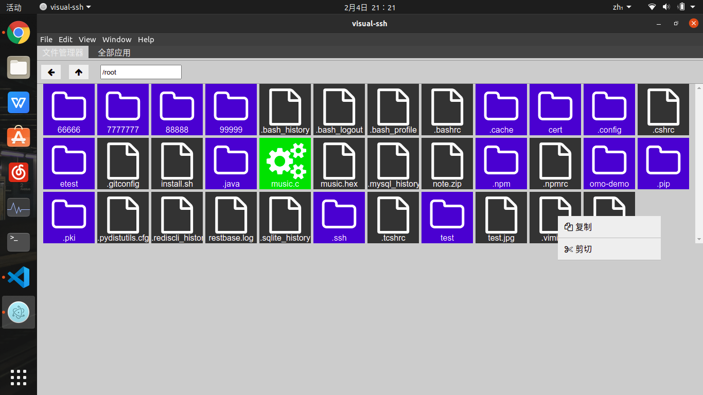
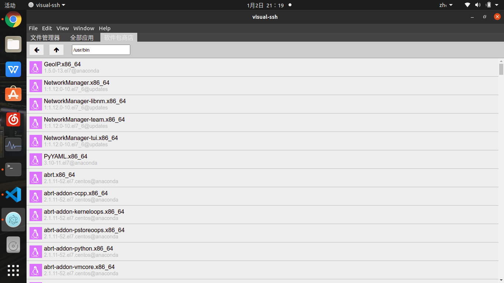

# visual-ssh

#### 介绍
visual-ssh是一款连接ssh服务的工具。
它会把ssh服务器返回的内容解析为图形界面,并根据你鼠标的操作，向服务器发送相应的指令。
操作远程linux主机就像操作自己的电脑一样简单。
#### 软件架构
visual-ssh 是基于Electron，使用Typescript开发的一个工具。目前它可以在Linux和mac系统下正常运行。
我在ubuntu20 、windows 10 和 macos10.15.5 环境下对它进行过测试。

当前支持的（就是我测试过的）远程系统：centos7 ubuntu20 macos10.15.5

#### 安装教程
###### 我要调试项目
1.  请先安装cmake
2.  安装typescript
3.  你的操作系统是:windows请看4，mac和linux请看5
4.  安装python
5.  安装yarn
6.  sudo yarn
7.  tsc 
8.  yarn start

#### 使用说明

1.  xxxx
2.  xxxx
3.  xxxx

#### 参与贡献

1.  Fork 本仓库
2.  新建 Feat_xxx 分支
3.  提交代码
4.  新建 Pull Request

