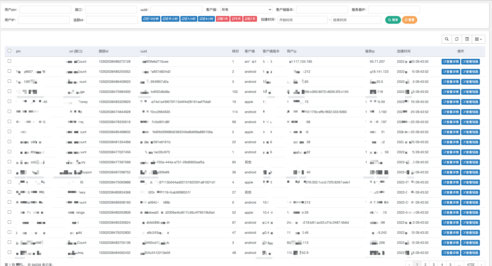
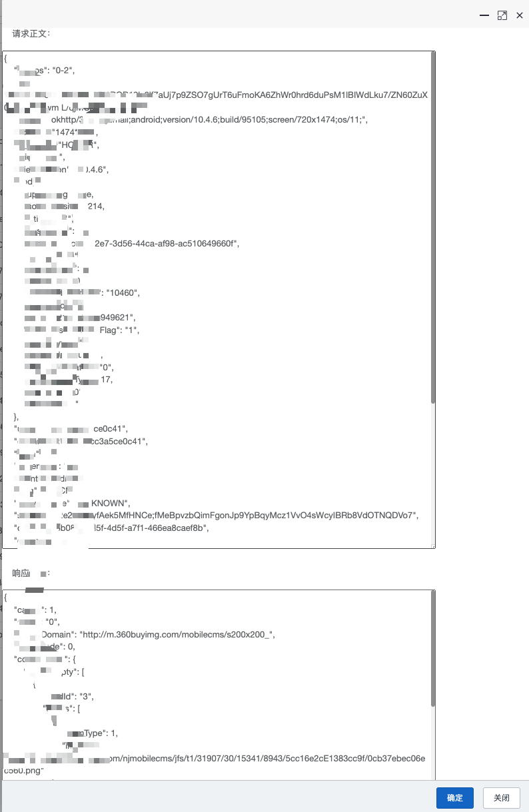
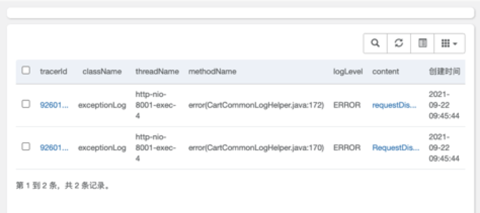
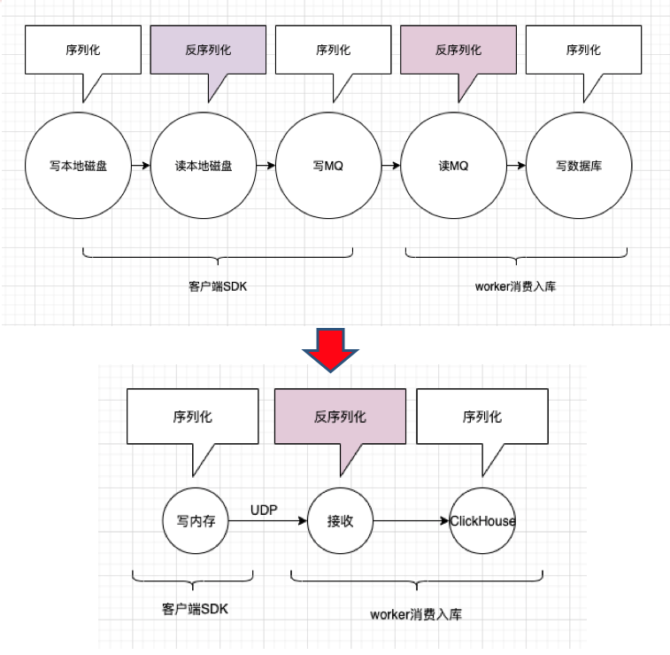
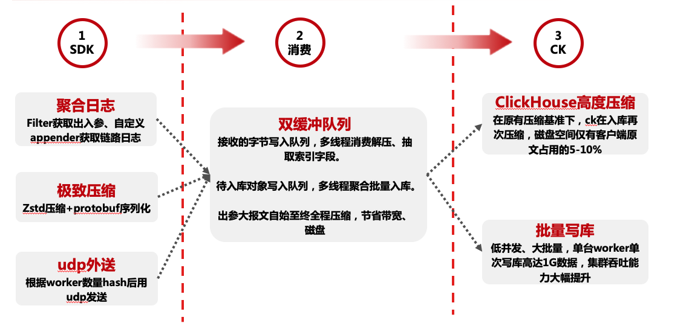
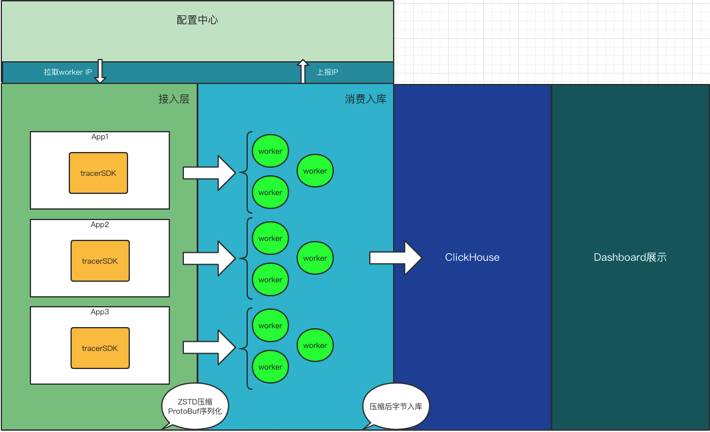

# 简介
该项目架构设计文章：https://my.oschina.net/1Gk2fdm43/blog/5312538

该项目主要为海量日志（秒级GB级）的搜集、传输、存储而设计的全套方案。区别于传统的如ELK系列套件，该项目主要是为了解决超大量级的日志（出入参、链路跟踪日志）从搜集到最后检索查询的中途产生的高昂硬件成本、性能低下等问题。

核心点在于 **性能、成本** 。

主要应用方向为： **用户跟踪** ，即根据特定条件，查询用户请求出入参、中途打印的所有日志，即这个链路的日志。

较ELK系列方案（filebeat、mq传输、es存储等常见方案），该框架拥有10倍以上的性能提升，和70%以上的磁盘节省。这意味着，在日志这个功能块上，使用相同的硬件配置，原本只能传输、存储一秒100M的日志，采用该方案，一秒可以处理1GB的日志，且将全链路因日志占用的磁盘空间下降70%。

由于该方案着重于极致的吞吐性能和极低的磁盘占用，而对数据全程进行了压缩。故并不适合于需要es关键字模糊查询的场景使用，而仅支持提前设定好的索引字段查询。数据库使用的是clickhouse集群，配置中心采用的etcd，如果之前没有相关经验的，还涉及了新技术的学习成本，以及需要对部分源码进行改造，故未必适合大部分项目使用。建议关注实现方案和处理超大量级的数据、缓冲、入库等代码逻辑即可，整套思路可适用于多种场景。

查询界面由于目前前端做的不太好，大概放个图大家了解意思就行，就是查用户跟踪的。
可以查询出入参，及请求整个链路的日志情况。

# 使用说明
[使用说明](https://gitee.com/jd-platform-opensource/jlog/blob/master/%E4%BD%BF%E7%94%A8%E8%AF%B4%E6%98%8E.md)

群已满200人，可加我微信备注JLog，邀请入群

# 背景
京东App作为一个巨大量级的请求入口，涉及了诸多系统，为了保证系统的健壮性、和请求溯源，以及出现问题后的问题排查，通常我们保存了用户请求从出入参、系统中途关键节点日志（info、error）、链路日志等，并且会将日志保存一段时间。

日志系统基本划分为几个模块：收集（filebeat、logstash等），传输（kafka、tcp直传等），存储（es，mysql、hive等），查询（kibana、自建）。

以传统日志解决方案为例，当有一个G的日志产生后，日志写本地磁盘（占用磁盘1G），读取后写入mq（mq占用2G，单备份），消费mq写入es（es占用1G），共需占用磁盘4GB，附带着网络带宽占用，和同体量的服务器资源占用（单服务器秒级处理100M）。

则以京东App的体量，当秒级百G日志产生时，所耗费的硬件资源相当庞大，成本已到了难以承受的地步。

该日志框架即为在有所取舍的情况下，支撑海量日志的场景所研发，如前文所讲，该方案在同等硬件配置下，较filebeat+mq+es的模式秒级 **日志吞吐量提升10倍，且全链路磁盘占用下降了70%以上** 。

# 方案简介
详细的可以看开头那篇文章。
这里只放两张图基本能说明原理。

基本流程为通过filter获取web请求出入参、自定义log4j、logback的appender搜集中途打印的日志，通过请求入口时生成的tracerId进行关联，写入本地内存（取代写磁盘），进行压缩（字符串空间占用减少80%以上），通过Udp发往worker端（取代mq），worker接收数据抽取索引字段，并入库clickhouse，除未来查询要用的索引字段外，其他内容全程压缩直至入库。

### 答疑

一 为什么是UDP而不是TCP？

主要区别，udp是知道对方的ip和端口，把消息发出去后，直接清空本地缓存。而tcp是发出去后，等待对方回复确认收到信息后，才会删除这条消息的缓存。一旦接收端卡顿，则客户端可能堆外内存溢出。并且通信时间翻倍，吞吐量下降。

二 UDP丢消息怎么办？

1 网络拥堵，交换机被打满。则无论udp tcp都发不出去了

2 重启机器，在空档期udp发出去的不会重发

3 worker消费入库不及，主动抛弃

总结：日志允许以上情况下的丢失，无需保证强可靠性

三 1台clickhouse，极限一秒写入180M，对应用户QPS约1万。
那么30台服务器如何支撑大促60万QPS，或更高？

前提：clickhouse性能是明确的，譬如一秒最多写1万用户QPS，则30台最高写30万。那么60万QPS时，
我们只能用别的地方去缓冲。
方案： 定制8核32G机器，单机开一个10万的队列，存放用户请求数据。批量入库，靠内存来吃下
大促陡增的几秒流量。则50台worker机器，即可拥有500万的内存队列，即便高峰是80万、100万，随后
逐步下降至30万、20万并维持。则一个能吃下30万的clickhouse集群足以支撑。
且worker机器可以随时扩容，平时4台支撑日常的1-5万的QPS，大促当天扩容即可，成本极低。

