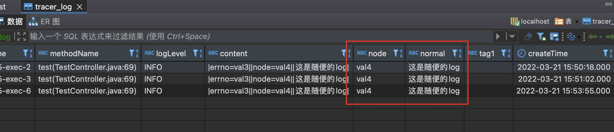

### 安装概要

有疑问可以进微信群咨询。

* 安装clickhouse（docker安装参考：https://www.runoob.com/docker/docker-tutorial.html）
   * 拉取镜像：docker pull yandex/clickhouse-server
   * 启动ck docker run -d --name ch-server --ulimit nofile=262144:262144 -p 8123:8123 -p 9000:9000 -p 9009:9009 yandex/clickhouse-server
   * 使用Dbeaver测试连接：clickhouse默认用户名是defult 没有密码
   * 建表：[sql语句](https://gitee.com/jd-platform-opensource/jlog/blob/master/worker/src/main/resources/jlog.sql)

* 启动worker
   * 配置ck地址，从config模块引入配置器，参考example项目application.properties。默认file配置器, （生产环境）建议继承FileConfigurator复写以维护worker配置，参考CustomConfigurator.class    
   * 启动worker，开启接收data

* 启动web服务（client端）参照example项目
   *  根据自己的log框架 引入对应的client.jar。选择对应的log xml配置以及覆写appender。参照3个clientlog*模块，或example-TracerLogbackAppender.class
   *  在配置文件或其他配置中心 配置好压缩提取等配置 参考example项目application.properties
   *  如果未配置workers，则向本地发送数据（用于测试）
   *  启动项目，用PostMan等工具调用TestController/test 接口，
   *  Dbeaver 查看数据
   
* 启动DashBoard


### Worker运行脚本示例

```shell
export JAVA_OPTS = -Xms25096m -Xmx25096m -Xmn16096m -XX:MetaspaceSize=256m -Xss256K -XX:+UseG1GC -XX:ParallelGCThreads=8 -Duser.timezone=Asia/Shanghai
export MYSQL_HOST = test
export MYSQL_USER	user
export MYSQL_PASS	pass
export INSERT_INTERVAL	1
export serverAddr	http://127.0.0.1:2379,http://127.0.0.1:xxxx
export BATCH_SIZE	7000
export MYSQL_PORT	8123
export NODE_NUMBER	15
export queueSize	8192
export POOL_SIZE	5
export threadCount	6
export DB_NAME	myDbName
export workerPath	AppName
export preDbSize	100000

# Set log directory for log4j
LOG_DIR=/export/Logs

# Set Java environment
JAVA_ENV="-Dlog-dir=$LOG_DIR"

if [ -z $etcdServer ];then
    etcdServer=http://127.0.0.1:2379
fi
# Run
java -jar $JAVA_OPTS $JAVA_ENV xxx.jar --etcd.server=${etcdServer}
```

其中配置的日志路径 可通过`${log-dir}`引入，也可以写在`web.xml`，或者直接在`log4j.xml`文件里写死。


### 记录数据说明

一条日志的数据可分为两种：出入参、链路日志。其中出入参的基本信息较为固定，而中途日志为请求中日志，用户可自行添加。

出入参日志有且不仅有：

- 链路id

- 应用名称

- 创建时间

- 请求耗时

- 请求接口

- 请求返回值

- 日志创建时间

- 请求入参相关自定义信息

  - 客户端种类

  - 客户端版本

  - 用户ip

  - 服务器ip

    ......


`JLog`总结了常用的日志参数，在Client端用**规范**的格式记录参数  (具体记录逻辑可见`HttpFIlter`类) 。在Worker端，针对定义的日志格式又有一些特殊处理（具体见`TracerConsumer`类）再入库。**那如何自定义日志记录格式和处理入库格式呢？**

- 仿照`HttpFIlter`自定义日志**记录格式**， 修改放入传输对象`tracerBean`的元素逻辑
- 仿照`TracerConsumer`自定义日志**入库格式**, 修改中途日志(`dealTracerLog`) /  出入参日志(`dealFilterModel`)的 入库对象构造方法
- 可能涉及更改`DashBoard`项目的**展示逻辑**

**待之后**优化支持**拓展点**修改日志格式和展示逻辑。


### Client example运行

- 配置配置器

  构建TracerClientStarter, 设置配置器，应用名

  ```java
  @Configuration
  public class Starter {
  
      @PostConstruct
      public void begin() {
          TracerClientStarter tracerClientStarter = new TracerClientStarter.Builder();
          // mdc   tagConfig       
          tracerClientStarter.startPipeline();
      }
  }
  ```

- 配置HttpFilter拦截器

  ```java
      @Bean
      public FilterRegistrationBean urlFilter() {
          FilterRegistrationBean registration = new FilterRegistrationBean();
          HttpFilter userFilter = new HttpFilter();
  
          registration.setFilter(userFilter);
          registration.addUrlPatterns("/*");
          registration.setName("HttpTraceFilter");
          registration.setOrder(1);
          return registration;
      }
  ```

- 自定义出参/入参增强（可选）

  ```java
      public class CustomRespMap implements RespMap {
      
          @Override
          public Map<String, Object> appendRespMap(String cnt) {
              
              return FastJsonUtils.toMap(cnt);
          }
      }
  ```

- 自定义配置器（可选，如果没有配置中心才需要）

  ```java
      @Component
      public class CustomConfigurator extends FileConfigurator {
    
          private CustomConfigurator() throws IOException {
              super();  
              cover(this);
          }
            
          @Override
          public List<String> getList(String key) {
              Set<Object> set = redisUtil.getMembers(key);
              return set.stream().map(v->(String)v).collect(Collectors.toList());
          }
            
          @Override
          public String getType() {
              return "custom-redis";
          }
      
      }
  ```  

- 配置日志框架 (log4j / log4j2 / logback)

  以log4j2举例，在配置的`log4j2.xml`文件中，引入JLog自有的Appender并设置

  ```xml
      <Appemders>
          <tracer name="tracerAppender"></tracer>
      </Appenders>
      
      <Loggers>
          <Logger name="RequestLog" level="INFO" additivity="false">
              <AppenderRef ref="requestLog"/>
              <AppenderRef ref="tracerAppender" />
          </Logger>
          <Root level="INFO" includeLocation="false"></Root>
      </Loggers>
  ```
  自定义配置器参照CustomConfigurator类（基于redis实现的配置器例子）

- 测试记录出入参

  配置`UserFilter`后符合拦截器拦截设置的，都会被记录出入参

- 测试记录中途日志

  详见`TestController`类

  ```java
  @RestController
  public class TestController {
      /**
       * do nothing
       * just as an adapter for this project common log helper
       *
       */
      private static Logger RequestLog = LoggerFactory.getLogger("RequestLog");
  
     @PostMapping(value = "/test", consumes = MediaType.APPLICATION_JSON_VALUE)
     public Object test(@RequestParam Integer uid, @RequestParam Integer newKey,@RequestBody TestReq req) {
        RequestLog.info("|errno=val3||node=val4||这是随便的log|");
        if(newKey == 1){
            return 1;
        }
        return new Resoponse("滴滴员工tangbohu的终身代号是什么？？？是9527");
    }
  
  }
  ```

  这里RequestLog为刚配置了引入JLog自带`Appender`的日志。所以这一条请求记录中，除了出入参外还有一条中途日志`“test”`。

- 测试模拟数据发送至worker

  模拟`UserFilter发`送构造好的出入参数据，udp发送给worker。可外嵌层for循环用于压测，详见`TracerPacketTest`类。


- clickhouse sql： worker服务下jlog.sql

- clickhouse存储样例：


