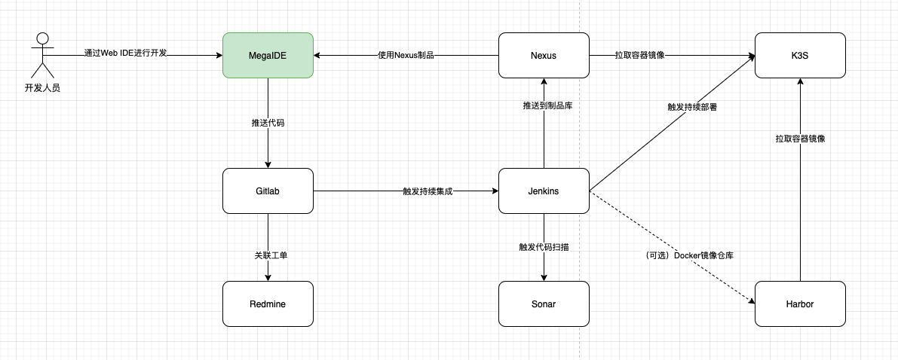
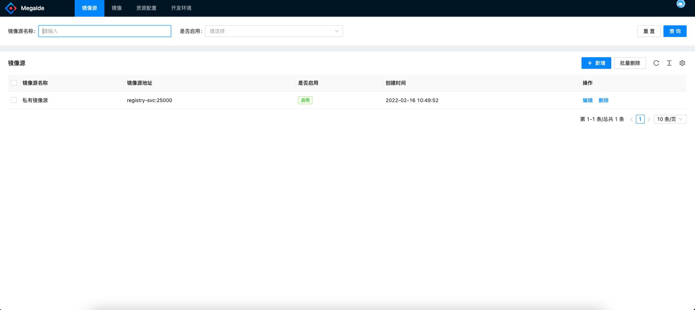
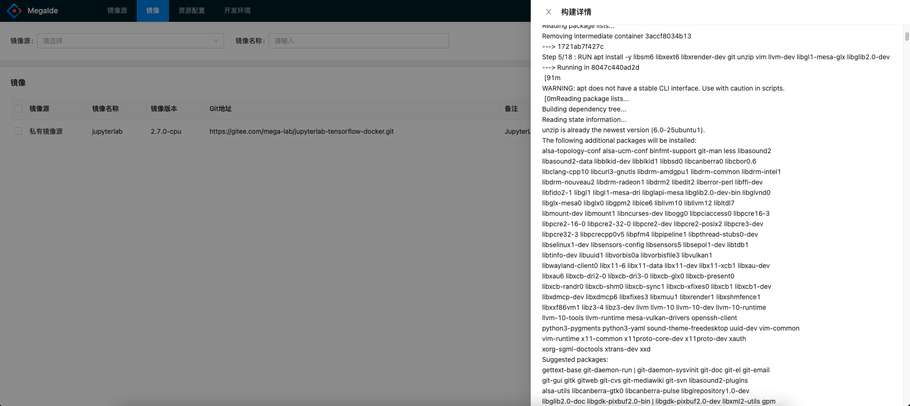
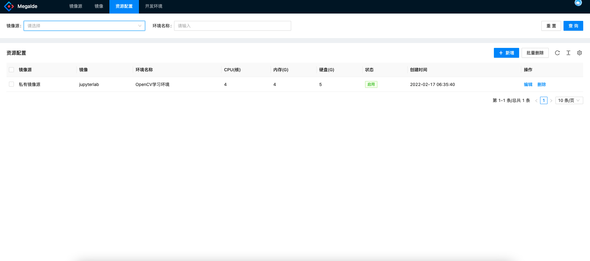
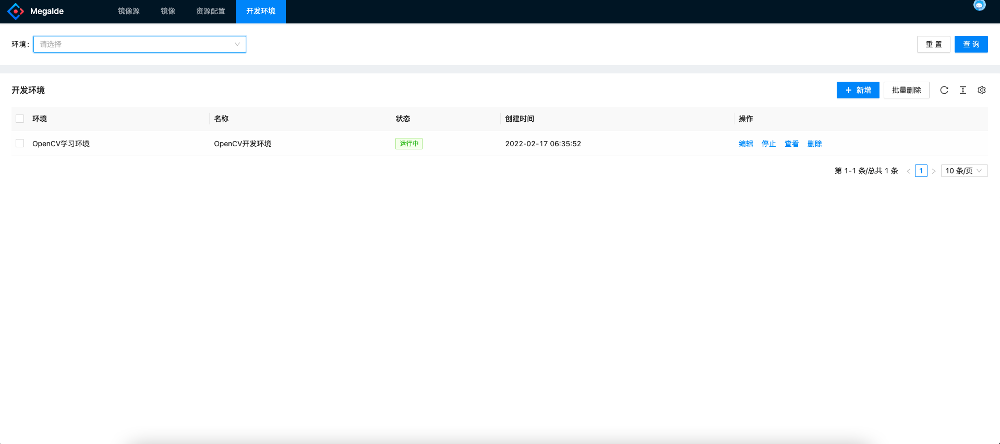

# MegaIDE

MegaIDE是一款基于Kubernetes的云IDE管理系统，支持对VSCode、Jupyter Lab、Projector等云IDE进行管理，提供用户自助开通开发环境的能力，是 DevOps流水线的入口

## MegaIDE的定位

## MegaIDE解决的问题

* 降低开发人员OnBoarding的成本：开发人员不再需要折腾环境，直接打开云端IDE即可开始开发
* 轻松切换环境：研发人员可以开设多个属于自己的开发环境，在多套环境之间便捷的切换
* 培训教学环境：MegaIDE可以帮助培训教学，使得教学资源利用率提升，同时提升教学的效果

## 核心功能

### 镜像源管理

支持管理员配置多套IDE可以使用的镜像源

### 镜像管理

镜像管理用于配置可供用户使用的镜像，并且提供构建镜像的能力

### 资源配置

管理员可以通过资源配置，为不同的开发环境给定不同的配额，便于做资源的管理

### 开发环境

用户可以在开发环境功能中开启多套开发环境，包括Jupyter Lab、VSCode、Projector等等

----
