### 快速进行 storage 开发

#### 开发环境
- ubuntu18, 可以使用 wsl
- go1.15+, python3
- jinja2
- go mod
- protobuf 3.17.3
- protoc-gen-go v1.26.0

#### storage 执行流程

#### 分层，简介
```sh
.
├── cmd  # storage 启动函数
│   └── root.go
├── dao  # 实际处理层，接口实现全部再 dao 层里实现
│   ├── dao.go
│   ├── dao_test.go
│   ├── interface.gen.go
│   ├── listx.go  # listx 相关功能
│   └── stringx.go
├── main.go
├── service  # 接口层，由 gen-service 自动生成
│   ├── define.go
│   ├── single.go
│   └── single_service.gen.go
└── temp # 开发模板层
    ├── const.gen.go
    ├── const.template
    ├── dao.template
    ├── service.template
    └── tem.yaml
```

#### 快速开发接口

> [快速开发视频 blibli](https://www.bilibili.com/video/BV1HL4y1v7ps)

1. 修改 temp/tem.yaml 文件，添加新接口
2. 在项目根目录执行 `make dcgen` 生成 proto 原始结构
3. 修改对应新添加接口的 proto 文件，再次执行 `make dcgen` 完成 proto 迁移
4. 执行 `make gen-service` 生成 dao 接口
5. 完成 新 dao 层接口, 根据需要添加单元测试。
6. 使用 make install 编译并且安装项目
