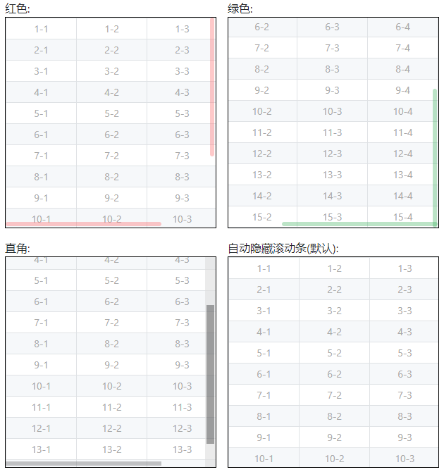

# x-scrollbar 自定义滚动条

## 概述

这是一个自定义滚动条插件.  

在现代前端环境下为什么还需要它, 它有什么特点:  
* 滚动条可以半透明的悬浮于内容上方(类似于移动端).
* 可以设置仅水平滚动(拨动鼠标滚轮将作用于X轴).

## 文档与示例  
<a target="_blank" href="https://xujz520.gitee.io/x-scrollbar/example.html">https://xujz520.gitee.io/x-scrollbar/example.html</a>



### 支持环境
|  |  |  |  |
| ---- | ---- | ---- | ---- |
| IE9~11 / Edge | Chrome | Firefox | Safari |
> IE浏览器不支持笔记本触控板的双指滚动, 需要外接鼠标

## 安装

### 直接在浏览器中使用
```html
<link rel="stylesheet" href="./xscrollbar.css">
```
```html
<script src="./xscrollbar.js"></script>
```

CDN
```html
<link rel="stylesheet" href="https://cdn.jsdelivr.net/npm/x-scrollbar/xscrollbar.css">
```
```html
<script src="https://cdn.jsdelivr.net/npm/x-scrollbar/xscrollbar.js"></script>
```

### 通过npm安装
```bash
npm i x-scrollbar --save
```
> 需要自行引入 ` node_modules/x-scrollbar/xscrollbar.css ` 样式
```js
import XScrollbar from 'x-scrollbar';
```

## 基础示例
```html
<!-- 容器 -->
<div id="container" style="width: 300px; height: 300px; overflow: auto; border: 1px solid #000;">
  <!-- 内容 -->
  <table></table>
</div>

<script>
  let $container = document.getElementById('container');
  let xscrollbar = new XScrollbar($container);
</script>
```

### 常用API(与原生无异)
```js
// 读取
$container.scrollLeft
$container.scrollTop

// 设置
$container.scrollLeft = 100
$container.scrollTop = 100

// 监听滚动
$container.addEventListener('scroll', function()  {
    //...
})
```