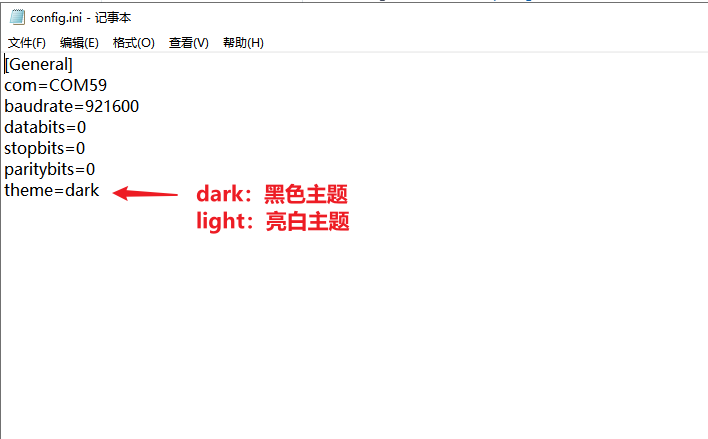
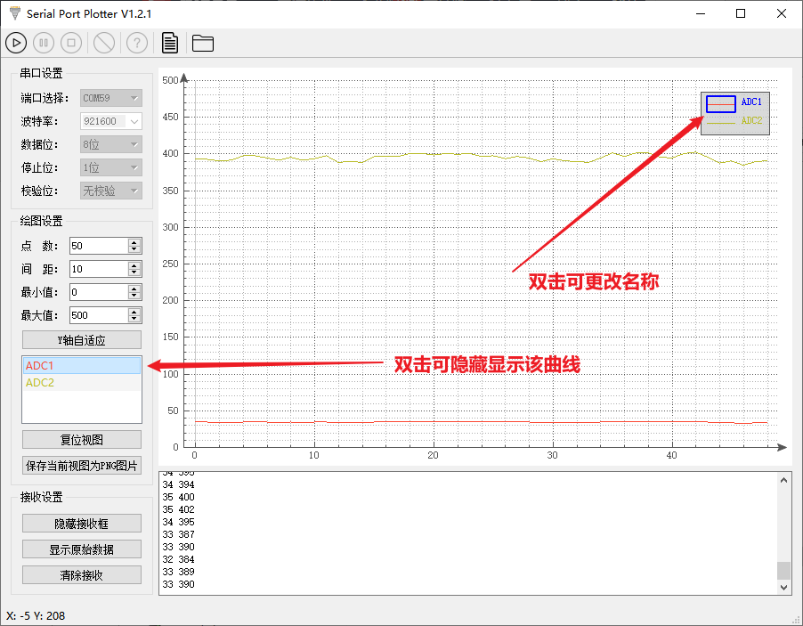

# SerialPortPlotter：一款开源基于Qt实现的多通道串口示波器

---

### 1、软件简介

#### V1.0

基于github开源作者`@CieNTi`的二次开发，修改程序后重新编译。

原作者github链接：[https://github.com/CieNTi/serial_port_plotter](https://github.com/CieNTi/serial_port_plotter)

修改的地方有：
- 修正了原作者程序里的bug，具体表现为二次开关串口后，保存为png图片按钮会变灰无法点击
- 界面全部改为中文显示
- 主题改为白色（原主题为黑色）
- 绘图范围扩大，原最大最小值范围为-65536至65536，现改为-99999999至999999999
- 去除刷新串口列表按钮，改为点击串口选择列表时候会自动刷新
- 新增清除接收按钮，可用于清除文本框的内容
- 汉化显示

#### V1.1

- 新增打开csv的保存文件目录按钮
- 新增串口当前配置自动保存，如本次退出软件时的波特率为921600，下次打开软件还是921600
- 新增保存csv文件时一同保存数据接收到的时间

#### V1.2

- 调整了点击QComboBox自动刷新串口列表的方式，原来是基于覆写QComboBox的方式，现在方式为基于事件。具体实现方法可见本篇博客：https://blog.csdn.net/qq153471503/article/details/123422722


#### V1.2.1

- 新增黑暗主题和亮白主题切换。具体切换方法为在配置文件'config.ini'中，修改theme这一项。
	


### 2、软件使用方法

本程序绘制从串口传入的实时数据。从远端设备发送的数据需要有一定的格式，每行必须以'$'开头，以';'结尾。取值必须以空格分隔。

从嵌入式设备发送数据到这个应用程序的例子:

```c
	printf("$%d %d;", ADC1, ADC2);
	wait_ms (10);
```

### 3、软件界面

**原作者编译软件界面图：**


**我修改后的软件界面图：**


