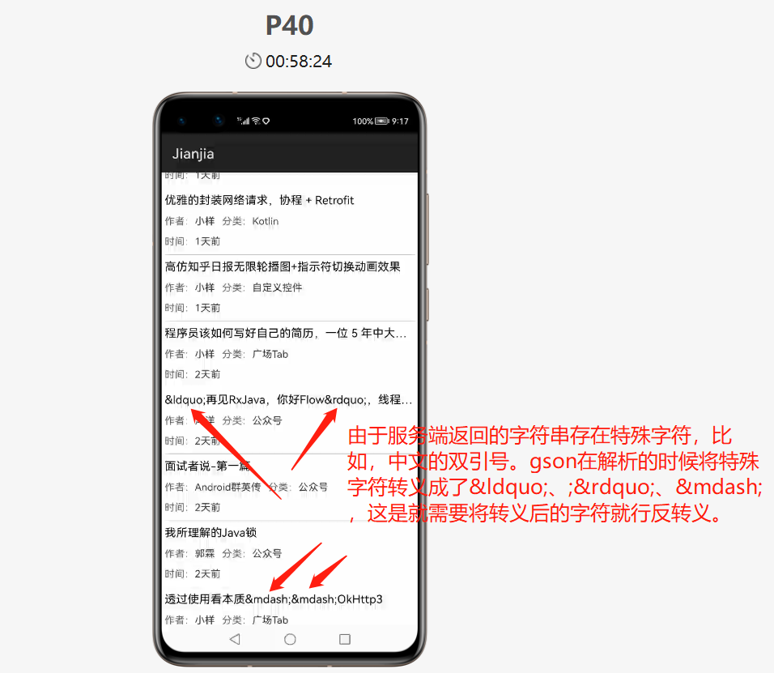
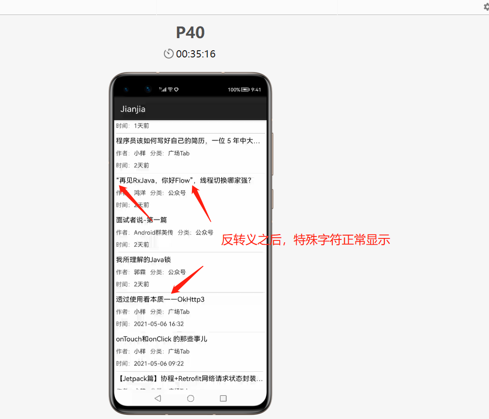
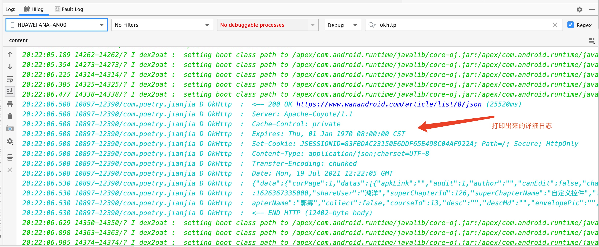

### 一、介绍
**蒹葭(JianJia)是一款鸿蒙系统上的网络请求框架，其实就是将安卓的Retrofit移植到鸿蒙系统上，我将鸿蒙版的Retrofit命名为蒹葭(JianJia)。蒹葭不仅能实现Retrofit的功能，还会提供一些Retrofit没有的功能。Retrofit不支持动态替换域名，国内的应用一般都是有多个域名的，蒹葭支持动态替换域名。**

### 二、添加依赖
2、1 在项目根目录下的`build.gradle`文件中添加`mavenCentral()`仓库，打开项目根目录下的`build.gradle`文件，在`build.gradle`文件的`repositories`闭包下面添加`mavenCentral()`
``` groovy
buildscript {
    repositories {
        // 添加maven中央仓库
        mavenCentral()
        maven {
            url 'https://mirrors.huaweicloud.com/repository/maven/'
        }
        maven {
            url 'https://developer.huawei.com/repo/'
        }
        maven {
            url 'http://maven.aliyun.com/nexus/content/repositories/central/'
        }
        jcenter()
    }
    dependencies {
        classpath 'com.huawei.ohos:hap:2.4.2.5'
        classpath 'com.huawei.ohos:decctest:1.0.0.6'
    }
}

allprojects {
    repositories {
        // 添加maven中央仓库
        mavenCentral()
        maven {
            url 'https://mirrors.huaweicloud.com/repository/maven/'
        }
        maven {
            url 'https://developer.huawei.com/repo/'
        }
        maven {
            url 'http://maven.aliyun.com/nexus/content/repositories/central/'
        }
        jcenter()
    }
}
```
2、2 打开entry目录下的`build.gradle`文件中，在`build.gradle`文件中的`dependencies`闭包下添加下面的依赖。
```groovy
// 蒹葭的核心代码
implementation 'io.gitee.zhongte:jianjia:1.0.2'
// 数据转换器，数据转换器使用gson来帮我们解析json，不需要我们手动解析json
implementation 'io.gitee.zhongte:converter-gson:1.0.1'
implementation "com.google.code.gson:gson:2.8.2"
// 日志拦截器，通过日志拦截器可以看到请求头、请求体、响应头、响应体
implementation 'com.squareup.okhttp3:logging-interceptor:3.7.0'
// 如果服务端返回的json有特殊字符，比如中文的双引号，gson在解析的时候会对特殊字符进行转义
// 这时就需要将转义后的字符串进行反转义，commons-lang可以对特殊字符进行转义和反转义
implementation 'commons-lang:commons-lang:2.6'
```
2、3 在配置文件中添加如下的权限
```
ohos.permission.INTERNET
```
### 三、用法
创建接口，在方法里面使用`GET`注解，`GET`注解用于标识这是一个`GET`请求，方法的返回值是`Call`对象，
泛型是`ResponseBody`，其实泛型也可以是具体的实体对象，这个后面再说。蒹葭如何完成网络请求？
使用构造者模式创建`jianjia`对象，`baseUrl`就是域名，在创建`jianjia`对象的时候就必须指定域名。
调用`create`方法来生成接口的实例，调用`wan.getBanner().enqueue`来执行网络请求，
请求成功就会回调`onResponse`方法，请求失败就会回调`onFailure`方法。
```
public interface Wan {
 
    @GET("banner/json")
    Call<ResponseBody> getBanner();
}
 
JianJia jianJia = new JianJia.Builder()
        .baseUrl("https://www.wanandroid.com")
        .build();
 
Wan wan = jianJia.create(Wan.class);
wan.getBanner().enqueue(new Callback<ResponseBody>() {
    @Override
    public void onResponse(Call<ResponseBody> call, Response<ResponseBody> response) {
        try {
            String json = response.body().string();
        } catch (IOException e) {
            e.printStackTrace();
        }
    }
 
    @Override
    public void onFailure(Call<ResponseBody> call, Throwable t) {
        LogUtils.info("yunfei", t.getMessage());
    }
});
```
在上面的示例代码中，接口里面定义的方法的方法的返回值是`Call`对象，泛型是`ResponseBody`。
在这种情况下，服务端返回给端上的数据就会在`ResponseBody`里面，端上需要手动解析`json`，
将`json`解析成一个实体类。其实，我们没必要手动解析`json`，可以让`gson`帮我们解析`json`。
蒹葭支持添加数据转换器，在创建对象的时候添加数据转换器，也就是把`gson`添加进来。
在`onResponse`方法里面就可以直接得到实体类对象了，`gson`帮我们把`json`解析成了一个实体对象。
如下代码，在`onResponse`方法里面调用`response.body()`，`body`方法直接返回了一个`banner`对象。
`gson`帮我们把服务端返回的`json`解析成banner对象，这样我们就可以直接使用`banner`对象，不需要我们手动解析`json`
```
public interface Wan {
 
    @GET("banner/json")
    Call<Banner> getBanner();
}
 
JianJia jianJia = new JianJia.Builder()
        .baseUrl("https://www.wanandroid.com")
        .addConverterFactory(GsonConverterFactory.create())
        .build();
 
Wan wan = jianJia.create(Wan.class);
wan.getBanner().enqueue(new Callback<Banner>() {
    @Override
    public void onResponse(Call<Banner> call, Response<Banner> response) {
        try {
            if (response.isSuccessful()) {
                // json已经被解析成banner对象了
                Banner banner = response.body();
            }
        } catch (IOException e) {
            e.printStackTrace();
        }
    }
 
    @Override
    public void onFailure(Call<Banner> call, Throwable t) {
        LogUtils.info("yunfei", t.getMessage());
    }
});
```
[更多用法请查看博客](https://www.jianshu.com/p/267a6b12abf8)
### 四、示例代码效果
</p>
在源码的`entry`目录下提供了示例代码，代码运行结果请查看上图。
上图显示的一个网页上的内容，端上使用蒹葭网络库访问该网站提供的接口来
获取首页的文章列表，当请求成功后，将文章列表显示在页面上。
目前只获取了第一页的文章列表，有兴趣的同学可以自行实现分页加载。
demo刚运行的时候页面白屏，那是因为此时正在请求网络，正常情况下，应当加个进度条，
只不过示例中没有进度条。**在运行示例代码时，如果在安装的时候出现`INSTALL_PARSE_FAILED_USESDK_ERROR`，
请把`config.json`文件中的`"releaseType": "Beta1"`删除。**
### 五、示例代码讲解
5、1 在示例代码中的`com.poetry.jianjia.net`包下面创建了如下的接口，把所有的请求放在一个接口里面即可，
没必要创建多个接口类。
```java
/**
 * @author 裴云飞
 * @date 2021/1/23
 */
public interface Wan {

    @GET("article/list/{page}/json")
    Call<ResponseBody> getArticle(@Path("page") int page);

    @GET("article/list/{page}/json")
    Call<Article> getHomeArticle(@Path("page") int page);

    @GET()
    Call<ResponseBody> getArticle(@Url String url);

    @GET("wxarticle/list/405/1/json")
    Call<ResponseBody> search(@Query("k") String k);

    @GET("wxarticle/list/405/1/json")
    Call<ResponseBody> search(@Query("k") String... k);

    @GET("wxarticle/list/405/1/json")
    Call<ResponseBody> search(@Query("k") List<String> k);

    @GET("wxarticle/list/405/1/json")
    Call<ResponseBody> search(@QueryMap Map<String, String> param);

    @GET("article/list/0/json")
    Call<ResponseBody> getArticle(@QueryMap Map<String, String> param);

    @BaseUrl("https://api.apiopen.top")
    @GET("getJoke")
    Call<ResponseBody> getJoke(@QueryMap Map<String, String> param);

    @POST("user/login")
    @FormUrlEncoded
    Call<ResponseBody> login(@Field("username") String username, @Field("password") String password);

    @POST("user/login")
    @FormUrlEncoded
    Call<ResponseBody> login(@FieldMap Map<String, String> map);

    @GET("banner/json")
    Call<Banner> getBanner();
}
```
5、2 创建`jianjia`对象，整个项目只需一个`jianjia`对象即可，如何确保只有一个
`jianjia`对象？当代码运行起来后，首先会创建`AbilityPackage`对象，
调用`AbilityPackage`的`onInitialize`方法，`AbilityPackage`执行完成后
才会启动`Ability`。`AbilityPackage`就是一个全局的单例，所以在
`AbilityPackage`里面创建的对象就是一个单例对象。只需在`AbilityPackage`
里面创建`jianjia`对象，就能确保整个项目只有一个`jianjia`对象。
`AbilityPackage`这个类不需要手动创建，在创建的项目的时候，
编译器会自动创建一个继承于`AbilityPackage`的类。
```java
public class BaseApplication extends AbilityPackage {

    private static BaseApplication instance;

    private JianJia mJianJia;
    private Wan mWan;

    public static BaseApplication getInstance() {
        return instance;
    }

    /**
     * 获取全局的蒹葭对象
     *
     * @return 全局的蒹葭对象
     */
    public JianJia getJianJia() {
        return mJianJia;
    }

    /**
     * 获取全局的接口实例对象
     *
     * @return 全局的接口实例对象
     */
    public Wan getWan() {
        return mWan;
    }

    @Override
    public void onInitialize() {
        super.onInitialize();
        instance = this;
        // 创建全局的蒹葭对象
        mJianJia = new JianJia.Builder()
                .baseUrl("https://www.wanandroid.com")
                .addConverterFactory(GsonConverterFactory.create())
                .build();
        mWan = mJianJia.create(Wan.class);
    }
}
```
如上代码，`BaseApplication`继承`AbilityPackage`，在`onInitialize`
方法创建全局的蒹葭对象。同时，整个项目只创建了一个接口类，所以可以在创建完蒹葭对象后
直接调用蒹葭的`create`方法来创建接口的实例对象。其它地方只需要通过下面的方式即可获取蒹葭对象和接口实例对象。
```
// 获取全局的蒹葭对象
BaseApplication.getInstance().getJianJia();
// 获取全局的接口实例对象
BaseApplication.getInstance().getWan();
```
5、3 在`MainAbilitySlice`里面添加`ListContainer`，关于`ListContainer`的用法，请查看
[官方文档](https://developer.harmonyos.com/cn/docs/documentation/doc-guides/ui-java-component-listcontainer-0000001060007847)
，这里不过多介绍了。接着调用`getHomeArticle`方法请求服务器，`getHomeArticle`方法会获取在`AbilityPackage`里面创建在接口实例对象来执行网络请求，
请求成功后调用`setHomeArticle`方法来刷新页面。
```java
public class MainAbilitySlice extends AbilitySlice {

    private ListContainer mListContainer;
    private HomeArticleProvider mHomeArticleProvider;
    List<Article.Data.Datas> mDatas;

    @Override
    public void onStart(Intent intent) {
        super.onStart(intent);
        super.setUIContent(ResourceTable.Layout_ability_main);
        mListContainer = (ListContainer) findComponentById(ResourceTable.Id_list);
        mDatas = new ArrayList<>();
        mHomeArticleProvider = new HomeArticleProvider(this, mDatas);
        mListContainer.setItemProvider(mHomeArticleProvider);
        // 从服务端获取数据
        getHomeArticle();
    }

    /**
     * 从服务端获取数据
     */
    public void getHomeArticle() {
        BaseApplication.getInstance().getWan().getHomeArticle(0).enqueue(new Callback<Article>() {
            @Override
            public void onResponse(Call<Article> call, Response<Article> response) {
                if (response.isSuccessful()) {
                    // 请求成功
                    setHomeArticle(response.body());
                }
            }

            @Override
            public void onFailure(Call<Article> call, Throwable t) {
                // 请求失败
                LogUtils.info("yunfei", t.getMessage());
            }
        });
    }

    @Override
    public void onActive() {
        super.onActive();
    }

    @Override
    public void onForeground(Intent intent) {
        super.onForeground(intent);
    }

    public void setHomeArticle(Article article) {
        if (article == null || article.data == null || article.data.datas == null) {
            return;
        }
        mDatas.addAll(article.data.datas);
        // 刷新列表
        mHomeArticleProvider.notifyDataChanged();
    }

}
```
5、4 解决转义字符问题。如果服务端返回的json有特殊字符，比如中文的双引号。
gson在解析的时候会对特殊字符进行转义，这时就需要将转义后的字符串进行反转义。如下图所示

如何将转义后的字符串进行反转义？`commons-lang`这个库可以将转义后的字符串进行反转义
在`build.gradle`文件添加下的依赖
```
// commons-lang可以对特殊字符进行转义和反转义
implementation 'commons-lang:commons-lang:2.6'
```
调用`StringEscapeUtils`的`unescapeHtml`方法，如果字符串中没有转义字符，`unescapeHtml`方法
会直接返回原字符串，否则会对字符串进行反转义。具体的代码可查看示例代码中的`HomeArticleProvider`类。
```
// json里面有一些特殊符号，特殊符号会被gson转义，
// StringEscapeUtils可以对转义的字符串进行反转义
String title = StringEscapeUtils.unescapeHtml(data.title);
componentHolder.title.setText(title);
```
反转义之后，特殊字符正常显示

### 六、获取请求和响应日志
6、1 可以通过charles、fiddler等抓包工具来查看到完整的请求和响应信息。关于抓包，可以自行搜索相关文章。<br/>
6、2 使用拦截器打印日志，添加下面的依赖
```
implementation 'com.squareup.okhttp3:logging-interceptor:3.7.0'
```
给OkHttp添加拦截器。
```
// 创建日志拦截器
HttpLoggingInterceptor logging = new HttpLoggingInterceptor();
logging.setLevel(HttpLoggingInterceptor.Level.BODY);
// 为OKHTTP添加日志拦截器
OkHttpClient okHttpClient = new OkHttpClient.Builder()
    .addInterceptor(logging)
    .build();
// 创建全局的蒹葭对象
mJianJia = new JianJia.Builder()
    // 使用自定义的okHttpClient对象
    .callFactory(okHttpClient)
    .baseUrl("https://www.wanandroid.com")
    .addConverterFactory(GsonConverterFactory.create())
    .build();
mWan = mJianJia.create(Wan.class);
```
经过上面的配置，就可以打印日志了

### 七、混淆
如果项目开启了混淆，请在`proguard-rules.pro`添加如下的代码。关于混淆，可以查看[鸿蒙代码配置混淆](https://www.jianshu.com/p/43fe805061ce)
```
-renamesourcefileattribute SourceFile
-keepattributes SourceFile,LineNumberTable
-dontwarn javax.annotation.**
-keepattributes Signature, InnerClasses, EnclosingMethod, Exceptions
# 蒹葭
-dontwarn poetry.jianjia.**
-keep class poetry.jianjia.** { *; }
-keepattributes RuntimeVisibleAnnotations, RuntimeVisibleParameterAnnotations
-keepclassmembers,allowshrinking,allowobfuscation interface * {
    @poetry.jianjia.http.* <methods>;
}

# OkHttp3
-dontwarn okhttp3.logging.**
-keep class okhttp3.internal.**{*;}
-dontwarn okio.**

# gson
-keep class sun.misc.Unsafe { *; }
-keep class com.google.gson.stream.** { *; }
-keepattributes *Annotation*
-keepclassmembers class * implements java.io.Serializable {
    static final long serialVersionUID;
    private static final java.io.ObjectStreamField[] serialPersistentFields;
    private void writeObject(java.io.ObjectOutputStream);
    private void readObject(java.io.ObjectInputStream);
    java.lang.Object writeReplace();
    java.lang.Object readResolve();
}
# 在我的示例代码中，com.poetry.jianjia.bean这个包下面的类实现了Serialized接口，
# 实现了Serialized接口的类不能被混淆，请把com.poetry.jianjia.bean这个包名替换成你自己的包名
-keep class com.poetry.jianjia.bean.**{*;}
```
### 八、感谢
感谢 [玩Android](https://www.wanandroid.com/blog/show/2) 提供的开放接口
### 九、开源许可证
```
Copyright [2021] [裴云飞]

Licensed under the Apache License, Version 2.0 (the "License");
you may not use this file except in compliance with the License.
You may obtain a copy of the License at

   http://www.apache.org/licenses/LICENSE-2.0

Unless required by applicable law or agreed to in writing, software
distributed under the License is distributed on an "AS IS" BASIS,
WITHOUT WARRANTIES OR CONDITIONS OF ANY KIND, either express or implied.
See the License for the specific language governing permissions and
limitations under the License.
```